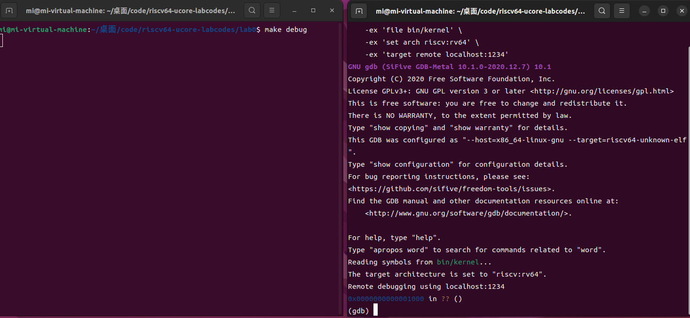

# Lab0.5

## 练习1: 使用GDB验证启动流程

### 实验过程

> 为了熟悉使用qemu和gdb进行调试工作,使用gdb调试QEMU模拟的RISC-V计算机加电开始运行到执行应用程序的第一条指令（即跳转到0x80200000）这个阶段的执行过程，说明RISC-V硬件加电后的几条指令在哪里？完成了哪些功能？

通过阅读实验指导手册，可以将QEMU模拟的RISC-V计算机加电开始运行到执行应用程序的第一条指令这个过程分为三个部分：

1. **加电**

2. **启动OpenSBI**

3. **启动os内核**

   #### 开启调试状态

   进入到lab0目录中，在两个终端中分别运行示例代码 Makefile 中的两条指令进行调试工作：

   ```assembly
   make debug
   make gdb
   ```

   执行后如图所示：

   

   #### 第一部分：加电

   ​	在图中可以看到，在最开始QEMU模拟的RISC-V计算机加电后，初始地址为0x1000。通过查阅资料可以发现，0x1000是复位地址，即计算机在启动或复位时执行的第一个指令的地址。

   ​	输入指令`x/10i $pc`，可以显示即将执行的10条汇编指令。

   ```assembly
   (gdb) x/10i $pc
   => 0x1000:	auipc	t0,0x0
      0x1004:	addi	a1,t0,32
      0x1008:	csrr	a0,mhartid
      0x100c:	ld	t0,24(t0)
      0x1010:	jr	t0
      0x1014:	unimp
      0x1016:	unimp
      0x1018:	unimp
      0x101a:	0x8000
      0x101c:	unimp
   ```

   `auipc t0, 0x0` ：将当前地址加上偏移量存储到 `t0`，最终将地址0x1000存入t0。

   `addi a1, t0, 32`：将 `t0` 加上 32 的值存入 `a1`，0x1020存入a1。

   `csrr a0, mhartid` ：从控制状态寄存器读取当前硬件线程 ID 到 `a0`。**`csrr`**（Control and Status Register Read）指令用于读取特定的控制状态寄存器的值，mhartid 是特定的控制状态寄存器，表示当前硬件线程 ID。

   `ld t0, 24(t0)` ：从 `t0` 偏移 24 字节的位置，**即0x1000+0x18（24）=0x1018**，加载数据到 `t0`，**t0中的值即为0x80000000**。

   `jr t0` ：跳转到 `t0` 指向的地址，0x80000000。

   `unimp` ：表示未实现的指令，通常是占位符。

   ​	在连续输入指令`si`后，程序如分析的结果一致，跳转到0x80000000。

   ```assembly
   gdb) si
   0x0000000000001004 in ?? ()
   (gdb) si
   0x0000000000001008 in ?? ()
   (gdb) si
   0x000000000000100c in ?? ()
   (gdb) si
   0x0000000000001010 in ?? ()
   (gdb) si
   0x0000000080000000 in ?? ()
   ```

   ​	**通过分析这10条指令可以发现，在加电后，计算机通过几条汇编语句实现了向OpenSBI.bin(0x80000000)的位置跳转，进行下一个部分。**

   #### 第二部分：启动OpenSBI

   在跳转到0x80000000后，通过指令`x/10i $pc`，查看即将执行的10条汇编指令。

   ```assembly
   (gdb) x/10i $pc
   => 0x80000000:	csrr	a6,mhartid
      0x80000004:	bgtz	a6,0x80000108
      0x80000008:	auipc	t0,0x0
      0x8000000c:	addi	t0,t0,1032
      0x80000010:	auipc	t1,0x0
      0x80000014:	addi	t1,t1,-16
      0x80000018:	sd	t1,0(t0)
      0x8000001c:	auipc	t0,0x0
      0x80000020:	addi	t0,t0,1020
      0x80000024:	ld	t0,0(t0)
   ```

   - **`csrr a6, mhartid`**：

     - 从控制状态寄存器读取当前硬件线程 ID，存入 `a6` 寄存器。

     **`bgtz a6, 0x80000108`**：

     - 如果 `a6` 的值大于 0，则跳转到地址 `0x80000108`。

     **`auipc t0, 0x0`**：

     - 将当前 PC 值（`0x80000008`）的高 20 位加上立即数 `0`，结果存入 `t0`。此时，`t0` = `0x80000000`。

     **`addi t0, t0, 1032`**：

     - 将 `1032` 加到 `t0` 中，结果为 `t0 = 0x80000000 + 0x0408 = 0x80000408`。

     **`auipc t1, 0x0`**：

     - 类似于之前，将当前 PC 值（`0x80000010`）的高 20 位存入 `t1`。此时，`t1 = 0x80000000`。

     **`addi t1, t1, -16`**：

     - 将 `-16` 加到 `t1` 中，结果为 `t1 = 0x80000000 - 0x10 = 0x7fffffff`。

     **`sd t1, 0(t0)`**：

     - 将 `t1` 中的值（`0x7fffffff`）存储到 `t0` 指向的内存地址（`0x80000408`）。

     **`auipc t0, 0x0`**：

     - 再次将当前 PC 值（`0x8000001c`）的高 20 位存入 `t0`，此时 `t0 = 0x80000000`。

     **`addi t0, t0, 1020`**：

     - 将 `1020` 加到 `t0`，结果为 `t0 = 0x80000000 + 0x03fc = 0x80000400`。

     **`ld t0, 0(t0)`**：

     - 从 `t0` 指向的地址（`0x80000400`）加载 64 位字到 `t0` 中

     

     ​	通过指令`l`可以显示当前执行位置附近的源代码行:

     ```assembly
     (gdb) l
     11	.section .data
     12	    # .align 2^12
     13	    .align PGSHIFT
     14	    .global bootstack
     15	bootstack:
     16	    .space KSTACKSIZE
     17	    .global bootstacktop
     18	bootstacktop:
     ```

     **`.align PGSHIFT`**：将数据对齐到页面大小的边界，`PGSHIFT` 通常是一个宏，定义了页面大小的位移（例如，12 表示 4KB 页面）。

     **`.global bootstack`**：声明 `bootstack` 作为全局符号，使其可以在其他文件中访问。

     **`bootstack:`**：定义了一个标签 `bootstack`，指向栈空间的起始位置。

     **`.space KSTACKSIZE`**：分配 `KSTACKSIZE` 字节的空间，通常用于分配内核栈。

     **`.global bootstacktop`**：类似于 `bootstack`，声明 `bootstacktop` 为全局符号。

     **`bootstacktop:`**：定义了一个标签 `bootstacktop`，指向栈空间的结束位置。

     ​	**结合分析汇编代码已经源代码可以发现：在跳转到0x8000000后，开始进行分配内核栈，为内核或操作系统的启动奠定基础。**

#### 第三部分：启动os内核

​	从实验指导手册中发现，os.bin加载到0x80200000，所以在0x80200000处打一个断点，随后执行到此处。

​	此时在**make debug的窗口中**可以发现出现OpenSBI图标，**说明在执行到0x80200000过程中OpenSBI已经成功启动。**

```assembly
(gdb) break *0x80200000
Breakpoint 1 at 0x80200000: file kern/init/entry.S, line 7.
(gdb) continue
Continuing.

Breakpoint 1, kern_entry () at kern/init/entry.S:7
7	    la sp, bootstacktop
```

​	通过指令`x/10i $pc`，查看即将执行的10条汇编指令。

```assembly
(gdb) x/10i $pc
=> 0x80200000 <kern_entry>:	auipc	sp,0x3
   0x80200004 <kern_entry+4>:	mv	sp,sp
   0x80200008 <kern_entry+8>:	j	0x8020000a <kern_init>
   0x8020000a <kern_init>:	auipc	a0,0x3
   0x8020000e <kern_init+4>:	addi	a0,a0,-2
   0x80200012 <kern_init+8>:	auipc	a2,0x3
   0x80200016 <kern_init+12>:	addi	a2,a2,-10
   0x8020001a <kern_init+16>:	addi	sp,sp,-16
   0x8020001c <kern_init+18>:	li	a1,0
   0x8020001e <kern_init+20>:	sub	a2,a2,a0
```

`kern_entry` 相关指令

1. **`auipc sp, 0x3`**：
   - 将当前 PC 的高 20 位加上 `0x3` 存入 `sp`（堆栈指针）。为了初始化堆栈指针。
2. **`mv sp, sp`**：
   - 将 `sp` 的值复制到自己。
3. **`j 0x8020000a <kern_init>`**：
   - 无条件跳转到 `kern_init` 函数的开始位置（`0x8020000a`）。

`kern_init` 相关指令

1. **`auipc a0, 0x3`**：
   - 将当前 PC 的高 20 位加上 `0x3` 存入 `a0` 寄存器。
2. **`addi a0, a0, -2`**：
   - 将 `-2` 加到 `a0` 中。
3. **`auipc a2, 0x3`**：
   - 将当前 PC 的高 20 位加上 `0x3` 存入 `a2` 寄存器。
4. **`addi a2, a2, -10`**：
   - 将 `-10` 加到 `a2` 中，进一步调整地址。
5. **`addi sp, sp, -16`**：
   - 将堆栈指针 `sp` 向下调整 16 字节，为后续操作分配栈空间。
6. **`li a1, 0`**：
   - 将立即数 `0` 加载到 `a1` 中。
7. **`sub a2, a2, a0`**：
   - 将 `a0` 从 `a2` 中减去，结果存回 `a2`。

​	**这段代码的主要目的是初始化内核的堆栈指针和寄存器，并设置一些变量，为内核的初始化过程做好准备；并且从kern_entry跳转到真正的入口点kern_init。**


