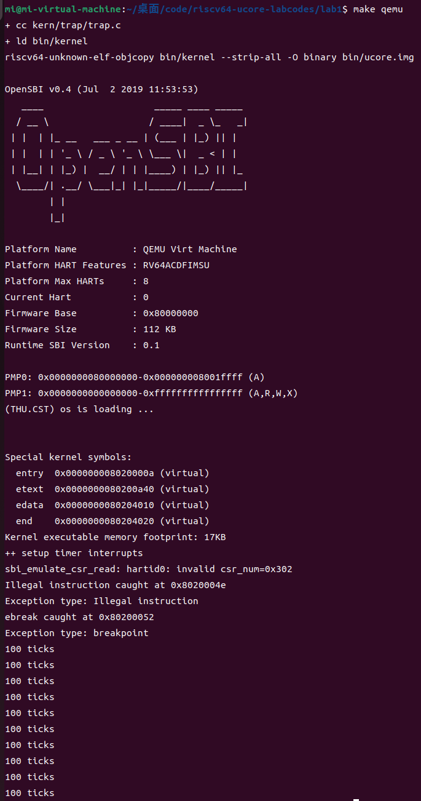

# 题目：

## 练习1

### 题目：阅读 kern/init/entry.S内容代码，结合操作系统内核启动流程，说明指令 la sp, bootstacktop 完成了什么操作，目的是什么？ tail kern_init 完成了什么操作，目的是什么？

### 回答

+ la sp，bootstacktop 是一条地址加载指令。完成的操作是初始化内核栈指针sp，将bootsatcktop符号的地址加载到栈顶指针sp中；目的是将 bootstacktop 所表示的内存地址当作内核堆栈的顶部，以便在内核执行时正确。使用栈内存这条指令对内核堆栈空间进行了初始化。
+ tail kern_init 是一个尾调用指令。完成的操作是跳转到 kern_init 函数的代码块，以启动内核初始化流程；目的是完成内核初始化，kern_init 作为内核主体代码的入口，负责初始化内核。该指令的特点是调用后不会返回到调用者，控制流直接转向 kern_init 函数，从而执行真正的内核初始化过程。此外，由于尾调用的特性，调用者的栈帧不会被保留，这样可以节省空间并提高跳转效率。

## 拓展练习challenge1：描述与理解中断流程

### 题目

回答：描述ucore中处理中断异常的流程（从异常的产生开始），其中mov a0，sp的目的是什么？SAVE_ALL中寄寄存器保存在栈中的位置是什么确定的？对于任何中断，__alltraps 中都需要保存所有寄存器吗？请说明理由。

### 回答

#### 处理中断异常的流程

- 中断发生时，cpu跳转至stvec
- 在Direct模式下，stvec中储存了中断处理程序的入口点，直接跳转
- 调用SAVE_ALL保存上下文到栈中
- 调用trap处理中断，并传入当前栈指针
- 如何调用RESTORE_ALL恢复状态
- sret返回被中断的地址

#### mov a0，sp的目的是什么？

- 之前的SAVE_ALL将寄存器都存到了栈上
- a0可以对调用的函数进行传参
- 所以调用的函数（trap）可以访问刚刚保存的上下文信息

#### SAVE_ALL中寄存器保存在栈中的位置是什么确定的？

- 保存在栈顶
- 由当前的栈顶位置确定

#### __alltraps 中都需要保存所有寄存器

- 因为在中断处理过程中，CPU的状态可能会被改变。保存所有寄存器能够确保在中断处理完成后，程序能够从中断前的状态恢复，避免丢失任何上下文信息。

## 拓展练习 Challenge2：理解上下文切换机制

### 在trapentry.S中汇编代码 csrw sscratch, sp；csrrw s0, sscratch, x0实现了什么操作，目的是什么？save all里面保存了stval scause这些csr，而在restore all里面却不还原它们？那这样store的意义何在呢？

#### 在trapentry.S中汇编代码 csrw sscratch, sp；csrrw s0, sscratch, x0实现了什么操作，目的是什么？

在 trapentry.S 中，汇编代码 csrw sscratch, sp 和 csrrw s0, sscratch, x0 实现的操作是：
+ csrw sscratch, sp 将中断产生时的栈指针（sp）值保存到 sscratch 特权寄存器中，以避免在保存所有上下文期间修改 sp 值而导致的问题；
+ csrrw s0, sscratch, x0 将 sscratch 中的原 sp 值读取到通用寄存器 s0，并将 sscratch 清零。
其目的是通过临时保存 sp 值，以便在调用 trap 处理例程时作为参数传递。同时，保存 stval 和 scause 等 CSR 寄存器用于记录异常中断的来源信息，如异常的指令地址和原因等。

#### save all里面保存了stval scause这些csr，而在restore all里面却不还原它们？

在 save all 中保存这些 CSR 寄存器的意义在于提供处理异常所需的上下文信息，而在 restore all 中不还原这些 CSR 值是因为它们仅在异常处理期间使用，恢复任务上下文时并不相关。此外，下一次中断可能会覆盖这些 CSR 值，因此不需要恢复它们。

#### 那这样store的意义何在呢？

通过 CSR 的暂存和传值，实现了 sp 值的保存和利用，同时记录中断来源信息，这对异常处理和转入 trap 例程至关重要。即使不还原 CSR，记录的信息也已被充分利用。

## 扩展练习Challenge3：完善异常中断

编程完善在触发一条非法指令异常 mret和，在 kern/trap/trap.c的异常处理函数中捕获，并对其进行处理，简单输出异常类型和异常指令触发地址，即“Illegal instruction caught at 0x(地址)”，“ebreak caught at 0x（地址）”与“Exception type:Illegal instruction"，“Exception type: breakpoint”。

##### 在 kern/trap/trap.c的异常处理函数中捕获并对其进行处理

```assembly
void exception_handler(struct trapframe *tf) {
    switch (tf->cause) {
        case CAUSE_MISALIGNED_FETCH:
            break;
        case CAUSE_FAULT_FETCH:
            break;
        case CAUSE_ILLEGAL_INSTRUCTION:
             /* LAB1 CHALLENGE3   2211448 :  */
            /*(1)输出指令异常类型（ Illegal instruction）
             *(2)输出异常指令地址
             *(3)更新 tf->epc寄存器
            */
            cprintf("Illegal instruction caught at 0x%08x\n", tf->epc);
            cprintf("Exception type: Illegal instruction\n");
            // 更新epc寄存器，设置为下一条指令地址
            // 读取指令内容（16位）
            uint16_t inst16 = *(uint16_t *)(uintptr_t)(tf->epc);
            
            // 判断是否为压缩指令
            if ((inst16 & 0x3) != 0x3) { // 压缩指令
                
                tf->epc += 2; // 16位指令长度
            } else { // 标准指令
                
                tf->epc += 4; // 32位指令长度
            }
            break;
        case CAUSE_BREAKPOINT:
         //Lab1 2211448
            //断点异常处理
            /* LAB1 CHALLLENGE3   2211448 :  */
            /*(1)输出指令异常类型（ breakpoint）
             *(2)输出异常指令地址
             *(3)更新 tf->epc寄存器
            */
            cprintf("ebreak caught at 0x%08x\n", tf->epc);
            cprintf("Exception type: breakpoint\n");
            // 更新epc寄存器，设置为下一条指令地址
            // 读取指令内容（16位）
            uint16_t bp_inst16 = *(uint16_t *)(uintptr_t)(tf->epc);
            
            // 判断是否为压缩指令
            if ((bp_inst16 & 0x3) != 0x3) { // 压缩指令
                
                tf->epc += 2; // 16位指令长度
            } else { // 标准指令
                
                tf->epc += 4; // 32位指令长度
            }
            break;
        case CAUSE_MISALIGNED_LOAD:
            break;
        case CAUSE_FAULT_LOAD:
            break;
        case CAUSE_MISALIGNED_STORE:
            break;
        case CAUSE_FAULT_STORE:
            break;
        case CAUSE_USER_ECALL:
            break;
        case CAUSE_SUPERVISOR_ECALL:
            break;
        case CAUSE_HYPERVISOR_ECALL:
            break;
        case CAUSE_MACHINE_ECALL:
            break;
        default:
            print_trapframe(tf);
            break;
    }
}
```

**需要注意异常指令是否为压缩指令（2字节），判断方法通过检查指令的最低两位，判断是16位压缩指令还是32位标准指令。**

- **压缩指令：最低两位不等于`11`，`epc`增加2字节。**

- **标准指令：最低两位等于`11`，`epc`增加4字节。**

##### 在init.c中触发异常

​	asm volatile ("mret");和asm volatile ("ebreak");通过内联汇编的方式分别触发非法指令异常和断点异常。

```assembly
int kern_init(void) {
    extern char edata[], end[];
    memset(edata, 0, end - edata);

cons_init();  // init the console

const char *message = "(THU.CST) os is loading ...\n";
cprintf("%s\n\n", message);

print_kerninfo();

// grade_backtrace();

idt_init();  // init interrupt descriptor table

// rdtime in mbare mode crashes
clock_init();  // init clock interrupt

intr_enable();  // enable irq interrupt

asm volatile (
"mret"
);
asm volatile (
    "ebreak"
);

while (1)
    ;

}
```

##### 结果验证：




# 不懂的问题：

##  为什么内核镜像被加载到0x80200000?

因为QEMU的OpenSBI中加载内核镜像的代码是**地址相关**的。

## 为什么要得到**内存布局合适**的elf文件？

最小可执行内核里, 我们主要完成两件事:

1. 内核的**内存布局**和入口点设置
2. 通过sbi封装好输入输出函数

## gnu工具链是什么？

GNU工具链是一组由GNU项目开发的开源编程工具，主要用于软件开发和编译。它通常包括编译器（如GCC）、汇编器、链接器（如ld）、调试器（如GDB）以及其他工具。GNU工具链广泛用于各种平台，特别是在Unix/Linux系统上，帮助开发人员创建、编译和调试程序。

## 我们通过连接器ld获取操作系统内核的elf文件（输出文件）时的输入文件（.O文件）是什么？


在获取操作系统内核的ELF文件时，输入文件通常是由编译器生成的目标文件（.o文件）。这些目标文件包含了编译后的代码和数据段，如.text、.data、.bss等，经过汇编和链接后，它们被合并成一个可执行的内核映像。具体来说，输入文件可能包括：

1. **内核模块的目标文件**：如系统调用、驱动程序和其他内核组件的编译结果。
2. **启动代码**：用于初始化系统的代码段，例如引导程序和入口点的汇编文件。
3. **库文件**：如果内核依赖于某些库或公共代码，这些文件也会作为输入。

通过链接器ld，这些目标文件的各个部分会根据链接脚本中的指示进行组合，生成最终的ELF格式的内核映像。

> 可能是需要我们之后自己实现的

## 为什么ld默认的链接脚本不适合链接一个操作系统内核，或者说链接一个操作系统内核时，有什么需要满足的特征吗？

ld默认的链接脚本通常是为用户空间程序设计的，不适合链接操作系统内核，主要因为以下特征：

1. **内存布局要求**：内核需要特定的内存布局，如将代码和数据段放置在物理内存的特定地址（如0x80000000或0x80200000），而用户程序通常使用动态地址分配。

2. **入口点**：内核有一个特定的入口点，通常是汇编代码中的一个标签，需要在链接脚本中明确指定，而用户程序的入口点通常是main函数。

3. **段的处理**：内核需要区分不同类型的内存段（如只读、读写、未初始化），而默认脚本可能未考虑这些特性，导致无法正确管理内存。

4. **没有操作系统支持的功能**：内核通常需要直接与硬件交互，而用户程序运行在操作系统提供的抽象层上，默认脚本的设置不适合这种低级别的控制。

5. **启动代码的支持**：内核可能需要引导代码以初始化硬件或设置内存，而默认脚本不一定包含这些要求。

因此，链接内核时需要自定义链接脚本，以满足这些特定需求。

## riscv语法问题：

### la指令的用法是什么？

`la`（load address）指令用于加载一个标签的地址到寄存器中。其基本用法是：

```assembly
la destination, label
```

这里，`destination`是目标寄存器，`label`是你要加载地址的标签。使用`la`可以获取数据段、代码段或其他段的地址，常用于初始化指针或设置栈顶。例如：

```assembly
la sp, bootstacktop  # 将bootstacktop的地址加载到栈指针寄存器sp
```

在这个例子中，`sp`将指向`bootstacktop`的内存地址，为后续的栈操作做好准备。

### tail的用法是什么？

在RISC-V汇编语言中，`tail`指令用于无条件跳转到指定的标签，同时确保不保存当前指令的返回地址。这意味着执行跳转后不会返回到调用点，适合用于实现递归或特定的控制流结构。

基本用法如下：

```assembly
tail label
```

这里，`label`是你要跳转到的目标标签。使用`tail`指令时，通常是为了优化某些函数调用，特别是在将要执行递归或其他形式的尾调用时。

例如：

```assembly
tail kern_init  # 跳转到kern_init，不保存返回地址
```

在这个例子中，控制流将直接跳转到`kern_init`，后续不会返回到跳转前的代码。这有助于节省栈空间，因为不需要在调用时保留返回地址。


## 什么是glibc，以及glibc提供的运行时环境？

glibc（GNU C Library）是GNU项目的C标准库，提供了C语言的标准函数和系统调用接口。它包含了基本的输入输出、字符串处理、内存管理等功能。

glibc提供的运行时环境包括初始化程序、线程管理、内存分配和系统调用的封装，使得C程序能够与操作系统进行交互。例如，glibc负责处理文件操作、进程控制和信号处理等，使得开发者可以更方便地编写与操作系统交互的程序。由于在ucore中没有glibc，因此需要自己实现这些功能。

## 为什么中断可以处理异常？

中断可以处理异常是因为中断机制允许系统在遇到异常情况时暂停当前执行的程序，并转而执行异常处理程序（M模式）。

## CSR是什么？

CSR（Control and Status Register）是控制和状态寄存器的缩写，是RISC-V架构中的特殊寄存器，用于控制处理器的行为和状态信息。CSR包含了多种功能，包括中断使能、异常处理、特权模式设置等。通过读写这些寄存器，软件可以控制处理器的操作模式，获取异常信息，并管理系统的资源和安全性。CSR是实现操作系统和硬件交互的重要接口。

## `stval`寄存器是什么？

当我们触发中断进入 S 态进行处理时，以下寄存器会被硬件自动设置，将一些信息提供给中断处理程序：

**sepc**(supervisor exception program counter)，它会记录触发中断的那条指令的地址；

**scause**，它会记录中断发生的原因，还会记录该中断是不是一个外部中断；

**stval**，它会记录一些中断处理所需要的辅助信息，比如指令获取(instruction fetch)、访存、缺页异常，它会把发生问题的目标地址或者出错的指令记录下来，这样我们在中断处理程序中就知道处理目标了。

## 怎么运行？

make qemu

## 如何停止？

调用sbi.h中的shut_down()函数关机

