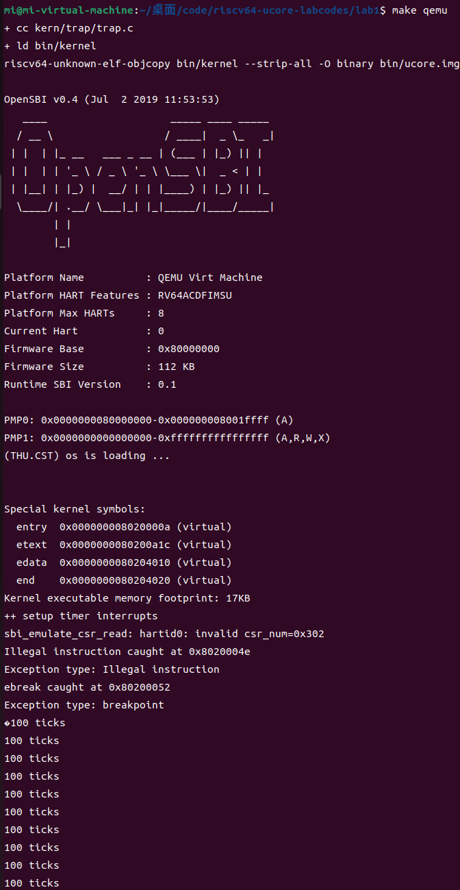

#### 扩展练习Challenge3：完善异常中断

编程完善在触发一条非法指令异常 mret和，在 kern/trap/trap.c的异常处理函数中捕获，并对其进行处理，简单输出异常类型和异常指令触发地址，即“Illegal instruction caught at 0x(地址)”，“ebreak caught at 0x（地址）”与“Exception type:Illegal instruction"，“Exception type: breakpoint”。

##### 在 kern/trap/trap.c的异常处理函数中捕获并对其进行处理

```assembly
void exception_handler(struct trapframe *tf) {
    switch (tf->cause) {
        case CAUSE_MISALIGNED_FETCH:
            break;
        case CAUSE_FAULT_FETCH:
            break;
        case CAUSE_ILLEGAL_INSTRUCTION:
             // 非法指令异常处理
             /* LAB1 CHALLENGE3   YOUR CODE :  */
            /*(1)输出指令异常类型（ Illegal instruction）
             *(2)输出异常指令地址
             *(3)更新 tf->epc寄存器
            */
             
            cprintf("Illegal instruction caught at 0x%08x\n", tf->epc);
            cprintf("Exception type: Illegal instruction\n");
            // 更新epc寄存器，设置为下一条指令地址
            tf->epc += 4;  // 每条指令4字节
            break;
            
        case CAUSE_BREAKPOINT:
            //断点异常处理
            / LAB1 CHALLLENGE3   YOUR CODE :  */
            /*(1)输出指令异常类型（ breakpoint）
             *(2)输出异常指令地址
             *(3)更新 tf->epc寄存器
            */
             // 断点异常处理
            cprintf("ebreak caught at 0x%08x\n", tf->epc);
            cprintf("Exception type: breakpoint\n");
            // 更新epc寄存器，设置为下一条指令地址
            tf->epc += 4;  // 假设每条指令4字节
            break;
```

##### 在init.c中触发异常

​	asm volatile ("mret");和asm volatile ("ebreak");通过内联汇编的方式分别触发非法指令异常和断点异常。

```assembly
int kern_init(void) {
    extern char edata[], end[];
    memset(edata, 0, end - edata);

cons_init();  // init the console

const char *message = "(THU.CST) os is loading ...\n";
cprintf("%s\n\n", message);

print_kerninfo();

// grade_backtrace();

idt_init();  // init interrupt descriptor table

// rdtime in mbare mode crashes
clock_init();  // init clock interrupt

intr_enable();  // enable irq interrupt

asm volatile (
"mret"
);
asm volatile (
    "ebreak"
);

while (1)
    ;

}
```

##### 结果验证：


