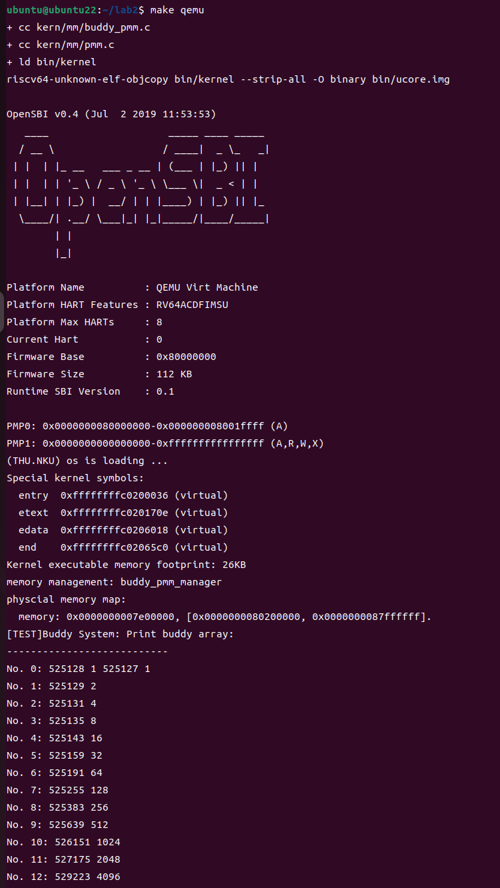

### 练习

对实验报告的要求：
 - 基于markdown格式来完成，以文本方式为主
 - 填写各个基本练习中要求完成的报告内容
 - 完成实验后，请分析ucore_lab中提供的参考答案，并请在实验报告中说明你的实现与参考答案的区别
 - 列出你认为本实验中重要的知识点，以及与对应的OS原理中的知识点，并简要说明你对二者的含义，关系，差异等方面的理解（也可能出现实验中的知识点没有对应的原理知识点）
 - 列出你认为OS原理中很重要，但在实验中没有对应上的知识点

## 练习0：填写已有实验

本实验依赖实验1。请把你做的实验1的代码填入本实验中代码中有“LAB1”的注释相应部分并按照实验手册进行进一步的修改。具体来说，就是跟着实验手册的教程一步步做，然后完成教程后继续完成完成exercise部分的剩余练习。

## 练习1：理解first-fit 连续物理内存分配算法（思考题）
first-fit 连续物理内存分配算法作为物理内存分配一个很基础的方法，需要同学们理解它的实现过程。请大家仔细阅读实验手册的教程并结合`kern/mm/default_pmm.c`中的相关代码，认真分析default_init，default_init_memmap，default_alloc_pages， default_free_pages等相关函数，并描述程序在进行物理内存分配的过程以及各个函数的作用。
请在实验报告中简要说明你的设计实现过程。请回答如下问题：

- 你的first fit算法是否有进一步的改进空间？

  ------

### default_init

```c
static void default_init(void) {
    list_init(&free_list);
    nr_free = 0;
}
```

#### 1.函数分析

1. **`list_init(&free_list);`**：将 `free_list` 的前向和后向指针都指向自己，形成一个空的双向链表。`free_list` 被用作链表头，用来链接所有的空闲页。
   
2. **`nr_free = 0;`**：`nr_free` 用来记录系统中当前空闲的物理页数量。初始状态下，系统尚未标识任何物理页为空闲，因此 `nr_free` 设置为 0。

#### 2.函数作用

`default_init` 函数的作用是为内存管理器的空闲页管理部分进行基础初始化。

1. **初始化空闲链表**：将 `free_list` 链表初始化为空，表示没有空闲页加入链表。
2. **初始化空闲页计数器**：将 `nr_free` 设置为 0，表示系统中没有标记空闲的物理页。

`default_init_memmap` 函数的主要作用是初始化一块连续的物理页，使其能够被操作系统用于内存分配。它将这块内存页标记为空闲页并加入到空闲页的管理链表中，以便后续的分配和释放操作。以下是对该函数的详细分析：

### default_init_memmap

```c
static void
default_init_memmap(struct Page *base, size_t n) {
    assert(n > 0);
    struct Page *p = base;
    for (; p != base + n; p++) {
        assert(PageReserved(p));
        p->flags = p->property = 0;
        set_page_ref(p, 0);
    }
    base->property = n;
    SetPageProperty(base);
    nr_free += n;

    if (list_empty(&free_list)) {
        list_add(&free_list, &(base->page_link));
    } else {
        list_entry_t* le = &free_list;
        while ((le = list_next(le)) != &free_list) {
            struct Page* page = le2page(le, page_link);
            if (base < page) {
                list_add_before(le, &(base->page_link));
                break;
            } else if (list_next(le) == &free_list) {
                list_add(le, &(base->page_link));
            }
        }
    }
}
```

#### 1.函数分析

1. **`assert(n > 0);`**：初始化的页数 `n` 大于 0。
   
2. **`struct Page *p = base;`**：定义一个指针 `p`，用于遍历从 `base` 开始的连续页区域。
   
3. **遍历并初始化每个 `Page` 结构体**：
   ```c
   for (; p != base + n; p++) {
       assert(PageReserved(p));
       p->flags = p->property = 0;
       set_page_ref(p, 0);
   }
   ```
   - 确保当前页 `p` 是被保留的（`PageReserved(p)`）。表示这些页在初始化之前是已经被内核标记为保留的状态。
   - 将当前页的 `flags` 和 `property` 清零。
   - 调用 `set_page_ref(p, 0)`，将页的引用计数设置为 0，表示当前没有对象引用这块页。
   
4. **设置base的属性**：
   
   ```c
   base->property = n;
   SetPageProperty(base);
   nr_free += n;
   ```
   - 将当前内存块的`base`的 `property` 设置为 `n`，表示该头部页管理 `n` 个连续的空闲页。
   - **`SetPageProperty`**：设置该页的 `PageProperty` 标志位，表示这是一个空闲页块的`base`。
   - **更新空闲页计数器 `nr_free`**：增加 `n`，表示系统中现在空闲页+n。
   
5. **将初始化的页块插入 `free_list` 中**：
   
   ```c
   if (list_empty(&free_list)) {
       list_add(&free_list, &(base->page_link));
   } else {
       list_entry_t* le = &free_list;
       while ((le = list_next(le)) != &free_list) {
           struct Page* page = le2page(le, page_link);
           if (base < page) {
               list_add_before(le, &(base->page_link));
               break;
           } else if (list_next(le) == &free_list) {
               list_add(le, &(base->page_link));
           }
       }
   }
   ```
   - 检查空闲链表是否为空。如果为空，则直接将页块插入链表。
   - 如果链表不为空，遍历链表，找到 `base` 小于链表中的某个 `page`，然后将 `base` 插入到该位置之前。如果遍历完链表都没有找到合适的位置，则将 `base` 插入到链表末尾。

#### 2.函数作用

1. **初始化一块连续的物理页**：将从 `base` 开始的 `n` 个连续的物理页进行初始化，将它们的状态、属性、引用计数等清零，以表示这块内存页可以被系统用于内存分配。
2. **设置base的属性**：将页块的base标记为管理 `n` 个连续空闲页，并更新空闲页的数量。
3. **将页块插入空闲链表**：将新的空闲页块插入到空闲页链表 `free_list` 中。

`default_alloc_pages` 函数的主要作用是根据 First-Fit 策略，从空闲页链表中分配至少 `n` 个连续的物理页。该函数会遍历空闲页链表，找到第一个足够大的空闲页块进行分配，并在成功分配后更新链表和空闲页计数器。

### default_alloc_pages

```c
static struct Page *default_alloc_pages(size_t n) {
    assert(n > 0);
    if (n > nr_free) {
        return NULL;
    }
    struct Page *page = NULL;
    list_entry_t *le = &free_list;
    while ((le = list_next(le)) != &free_list) {
        struct Page *p = le2page(le, page_link);
        if (p->property >= n) {
            page = p;
            break;
        }
    }
    if (page != NULL) {
        list_entry_t* prev = list_prev(&(page->page_link));
        list_del(&(page->page_link));
        if (page->property > n) {
            struct Page *p = page + n;
            p->property = page->property - n;
            SetPageProperty(p);
            list_add(prev, &(p->page_link));
        }
        nr_free -= n;
        ClearPageProperty(page);
    }
    return page;
}
```

#### 1.函数分析

1. **`assert(n > 0);`**：确保请求的页数 `n` 大于 0。
   
2. **检查空闲页数量 `nr_free`**：
   ```c
   if (n > nr_free) {
       return NULL;
   }
   ```
   如果请求的页数 `n` 大于当前空闲页的数量 `nr_free`，则无法满足请求，直接返回 `NULL`。**遍历空闲链表，寻找合适的页块**：

   ```c
   struct Page *page = NULL;
   list_entry_t *le = &free_list;
   while ((le = list_next(le)) != &free_list) {
       struct Page *p = le2page(le, page_link);
       if (p->property >= n) {
           page = p;
           break;
       }
   }
   ```
   - 遍历空闲链表 `free_list`，寻找第一个满足条件的页块 `p`，即 `p->property >= n`。这意味着页块 `p` 拥有的连续空闲页数大于或等于请求的页数 `n`。
   - **`list_next`** 用于获取链表中的下一个节点，`le2page` 用于将链表节点转换为对应的 `Page` 结构体。
   
4. **分配页块**：
   ```c
   if (page != NULL) {
       list_entry_t* prev = list_prev(&(page->page_link));
       list_del(&(page->page_link));
       if (page->property > n) {
           struct Page *p = page + n;
           p->property = page->property - n;
           SetPageProperty(p);
           list_add(prev, &(p->page_link));
       }
       nr_free -= n;
       ClearPageProperty(page);
   }
   ```
   - 如果找到符合条件的页块 `page`，则执行分配操作。
     - 记录当前页块的前一个链表节点 `prev`。
     - 从空闲链表中删除找到的页块 `page`。
     - 如果找到的页块 `page` 的 `property` 大于 `n`，则需要将剩余的空闲页重新加入到链表中：
       - 计算剩余空闲页的起始地址 `p`（即 `page + n`）。
       - 将剩余页的 `property` 设置为 `page->property - n`，表示剩余的空闲页数量。
       - 设置 `p` 为属性页（`SetPageProperty`），并将其加入到空闲链表中。
     - 更新空闲页计数器 `nr_free`，减少 `n`。
     - 清除找到的页块 `page` 的 `PageProperty` 标志，表示这些页已被分配。

#### 2.函数作用

`default_alloc_pages` 函数的主要作用是使用First-Fit 算法进行内存分配。

1. **遍历空闲页链表**：从链表的起始位置开始，寻找第一个可以满足请求的空闲页块。
2. **执行内存分配**：当找到合适的空闲页块后，根据请求的页数 `n`，将该空闲页块从链表中移除，并更新页块的状态。
3. **更新空闲页状态**：在成功分配内存后，更新空闲页链表和空闲页计数器 `nr_free`，记录剩余的空闲页信息。

`default_free_pages` 函数的主要作用是将已经分配的 `n` 个连续物理页释放，并将它们重新加入到空闲页链表中。该函数不仅要将这些页标记为空闲，还要尽可能地将相邻的空闲页合并，以减少内存碎片。

### default_free_pages

```c
static void default_free_pages(struct Page *base, size_t n) {
    assert(n > 0);
    struct Page *p = base;
    for (; p != base + n; p++) {
        assert(!PageReserved(p) && !PageProperty(p));
        p->flags = 0;
        set_page_ref(p, 0);
    }
    base->property = n;
    SetPageProperty(base);
    nr_free += n;

    if (list_empty(&free_list)) {
        list_add(&free_list, &(base->page_link));
    } else {
        list_entry_t* le = &free_list;
        while ((le = list_next(le)) != &free_list) {
            struct Page* page = le2page(le, page_link);
            if (base < page) {
                list_add_before(le, &(base->page_link));
                break;
            } else if (list_next(le) == &free_list) {
                list_add(le, &(base->page_link));
            }
        }
    }

    // 合并相邻的空闲页
    list_entry_t* le = list_prev(&(base->page_link));
    if (le != &free_list) {
        p = le2page(le, page_link);
        if (p + p->property == base) {
            p->property += base->property;
            ClearPageProperty(base);
            list_del(&(base->page_link));
            base = p;
        }
    }

    le = list_next(&(base->page_link));
    if (le != &free_list) {
        p = le2page(le, page_link);
        if (base + base->property == p) {
            base->property += p->property;
            ClearPageProperty(p);
            list_del(&(p->page_link));
        }
    }
}
```

#### 1.函数分析

1. **参数和初始检查**：
   ```c
   assert(n > 0);
   struct Page *p = base;
   ```
   - 确保释放的页数 `n` 大于 0。`base` 是要释放的连续页的起始地址。

2. **遍历并重置每个 `Page` 的状态**：
   ```c
   for (; p != base + n; p++) {
       assert(!PageReserved(p) && !PageProperty(p));
       p->flags = 0;
       set_page_ref(p, 0);
   }
   ```
   - 遍历从 `base` 开始的每个 `Page`，确保这些页没有被保留且不属于其他内存块的头部页。
   
3. **设置头部页的属性**：
   ```c
   base->property = n;
   SetPageProperty(base);
   nr_free += n;
   ```
   - 将 `base` 页的 `property` 设置为 `n`，表示这块内存页的头部页拥有 `n` 个连续的空闲页。标记该页为属性页，并更新空闲页计数器 `nr_free`。

4. **将新释放的页块插入空闲链表**：
   
   ```c
   if (list_empty(&free_list)) {
       list_add(&free_list, &(base->page_link));
   } else {
       list_entry_t* le = &free_list;
       while ((le = list_next(le)) != &free_list) {
           struct Page* page = le2page(le, page_link);
           if (base < page) {
               list_add_before(le, &(base->page_link));
               break;
           } else if (list_next(le) == &free_list) {
               list_add(le, &(base->page_link));
           }
       }
   }
   ```
   - 将新的空闲页块插入到空闲链表 `free_list` 中。
   
5. **合并相邻的空闲页块：**
   
   ```c
   list_entry_t* le = list_prev(&(base->page_link));
   if (le != &free_list) {
       p = le2page(le, page_link);
       if (p + p->property == base) {
           p->property += base->property;
           ClearPageProperty(base);
           list_del(&(base->page_link));
           base = p;
       }
   }
   ```
   - 向前合并相邻的空闲页块。如果 `base` 页的前一个页块 `p` 与 `base` 相邻，则将 `p` 的 `property` 加上 `base` 的 `property`，并清除 `base` 页的属性标志位，将其从链表中删除。
   
   ```c
   le = list_next(&(base->page_link));
   if (le != &free_list) {
       p = le2page(le, page_link);
       if (base + base->property == p) {
           base->property += p->property;
           ClearPageProperty(p);
           list_del(&(p->page_link));
       }
   }
   ```
   - 向后合并相邻的空闲页块。

#### 2.函数作用

`default_free_pages` 函数的主要作用是：

1. **标记释放的页为空闲**：将一段连续的物理页从已分配状态转换为空闲状态。
2. **插入空闲链表**：将新释放的页块插入到空闲链表 `free_list` 中，并确保链表的有序性。
3. **合并相邻的空闲页块**：在释放页块的过程中，尽可能地与前后相邻的空闲页块合并，减少内存碎片。

### 物理内存分配的过程

1. **初始化**：通过 `default_init` 和 `default_init_memmap` 函数，将空闲页链表和空闲页的基本信息初始化，并将可用的物理页标记为空闲，加入到空闲链表中。
2. **分配页**：在 `default_alloc_pages` 函数中，根据 First-Fit 遍历空闲页链表，找到第一个满足大小要求的空闲页块，将其从链表中取出并返回给调用者。
3. **释放页**：在 `default_free_pages` 函数中，将要释放的页块插入到空闲页链表中，并尝试合并相邻的空闲页块，以保持内存的连续性。

### First-Fit改进方向：

#### 1. **改进合并相邻空闲页块的策略**
 `default_free_pages` 函数在释放页时只尝试与前后相邻的页块进行合并。

**改进建议**：
- **批量合并**：在释放多个页块时，批量检查并合并所有相邻的空闲块，减少合并操作的次数。
- **延迟合并**：在某些情况下，可以延迟合并操作，将其放在空闲时机较好的时候进行，以减少频繁的合并开销。

#### 2. **使用更高效的数据结构管理空闲块**
**改进建议**：

- **红黑树**：使用红黑树来管理空闲块，可以在对数时间内完成插入、删除和查找操作，提升整体性能。
- **位图**：使用位图来表示内存页的使用状态，可以更高效地进行内存查找和管理。

## 练习2：实现 Best-Fit 连续物理内存分配算法（需要编程）
在完成练习一后，参考kern/mm/default_pmm.c对First Fit算法的实现，编程实现Best Fit页面分配算法，算法的时空复杂度不做要求，能通过测试即可。
请在实验报告中简要说明你的设计实现过程，阐述代码是如何对物理内存进行分配和释放，并回答如下问题：

- 你的 Best-Fit 算法是否有进一步的改进空间？

### 实现Best-Fit 算法：

相较于练习1中的First-Fit算法，只需要修改alloc_pages这一部分，修改内容如下：

```c
 size_t min_size = nr_free + 1;
     /*LAB2 EXERCISE 2: 2211448*/ 
    // 下面的代码是first-fit的部分代码，请修改下面的代码改为best-fit
    // 遍历空闲链表，查找满足需求的空闲页框
    // 如果找到满足需求的页面，记录该页面以及当前找到的最小连续空闲页框数量
    

while ((le = list_next(le)) != &free_list) {
    struct Page *p = le2page(le, page_link);
    if(p->property >= n && p->property <min_size) 
   {
        page = p;
        min_size=p->property;
        
    }
}
```

min_size：记录当前找到的最小连续空闲页框数量

**满足需求的页面：连续空闲页框数量>=n&&<当前找到的最小连续空闲页框数量**

### Best-Fit 算法的改进空间

1. **时间复杂度优化**：
   - **当前实现**：Best-Fit 需要遍历整个空闲链表以找到最优块，时间复杂度为 O(n)。
   - **改进**：可以采用红黑树来加速最优块的查找过程，将时间复杂度降低至 O(log n)。
2. **空闲块管理优化**：
   - **分级空闲链表**：将空闲块按照大小分级管理，使用多个空闲链表，每个链表负责特定大小范围的空闲块，从而减少查找时间。
   - **内存分区**：将内存划分为多个区域，每个区域使用不同的分配策略，针对不同大小的请求选择最合适的分配策略。
3. **合并策略优化**：
   - **延迟合并**：在释放页框时，不立即合并相邻块，而是延迟合并，以减少频繁的合并操作，提高释放效率。

#### 扩展练习Challenge：buddy system（伙伴系统）分配算法（需要编程）

Buddy System算法把系统中的可用存储空间划分为存储块(Block)来进行管理, 每个存储块的大小必须是2的n次幂(Pow(2, n)), 即1, 2, 4, 8, 16, 32, 64, 128...

 -  参考[伙伴分配器的一个极简实现](http://coolshell.cn/articles/10427.html)， 在ucore中实现buddy system分配算法，要求有比较充分的测试用例说明实现的正确性，需要有设计文档。

#### 扩展练习Challenge：任意大小的内存单元slub分配算法（需要编程）

slub算法，实现两层架构的高效内存单元分配，第一层是基于页大小的内存分配，第二层是在第一层基础上实现基于任意大小的内存分配。可简化实现，能够体现其主体思想即可。

 - 参考[linux的slub分配算法/](http://www.ibm.com/developerworks/cn/linux/l-cn-slub/)，在ucore中实现slub分配算法。要求有比较充分的测试用例说明实现的正确性，需要有设计文档。

#### 扩展练习Challenge：硬件的可用物理内存范围的获取方法（思考题）
  - 如果 OS 无法提前知道当前硬件的可用物理内存范围，请问你有何办法让 OS 获取可用物理内存范围？


> Challenges是选做，完成Challenge的同学可单独提交Challenge。完成得好的同学可获得最终考试成绩的加分。

## 扩展练习Challenge1：buddy system（伙伴系统）分配算法（需要编程）

Buddy System算法把系统中的可用存储空间划分为存储块(Block)来进行管理, 每个存储块的大小必须是2的n次幂(Pow(2, n)), 即1, 2, 4, 8, 16, 32, 64, 128...

+ 参考伙伴分配器的一个极简实现， 在ucore中实现buddy system分配算法，要求有比较充分的测试用例说明实现的正确性，需要有设计文档。

### 1.原理解释
伙伴系统将内存抽象为一个完全二叉树结构，每个节点表示一个内存块。树的叶节点是最小的内存块单位，而非叶节点的大小为其左右子节点大小之和。每个节点有两个属性：size（表示该节点所代表的内存大小）和 longest（表示该节点及其子树中最大可分配的内存块大小）。

+ 内存分配
内存分配时，算法从二叉树的根节点开始查找符合要求的最小内存块。通过对比longest值，找到一个可分配的节点，并更新其及其父节点的longest值。例如，如果需要分配一个大小为 2^k 的内存块，算法会查找第一个 longest 值大于等于 2^k 的节点，将该节点的 longest 值更新为剩余内存的大小。

+ 内存释放
当一个内存块被释放时，系统会检查该块的伙伴是否空闲。如果是，则合并两个伙伴块，并递归向上合并。这是通过判断节点的longest值来完成的。当伙伴合并时，父节点的longest值会被更新为当前合并块的大小。通过这种递归合并的策略，伙伴系统能够有效减少内存碎片，提高内存利用率。

+ 高效的实现
这种设计通过使用二叉树和longest数组，使得内存块的分配和释放具有高度的运算效率。longest数组简化了判断节点是否空闲、是否可以合并等操作，使得伙伴系统既可以快速查找符合要求的内存块，也能够在释放内存时迅速进行合并。

伙伴系统通过二叉树结构和递归的分配与合并策略，使得内存管理高效，减少了外部碎片。

### 2.代码编写
#### （1）内存划分和初始化：
```
static void buddy_init(void) {
    for (int i = 0; i <= MAX_BUDDY_ORDER; i++) {
        list_init(&buddy_array[i]);
    }
    max_order = 0;
    nr_free = 0;
}

static void buddy_init_memmap(struct Page *base, size_t n) {
    assert(n > 0);
    size_t pnum = ROUNDDOWN2(n);
    size_t order = getOrderOf2(pnum);
    struct Page *p = base;

    for (; p != base + pnum; p++) {
        assert(PageReserved(p));
        p->flags = 0;
        p->property = 0;
        set_page_ref(p, 0);
    }

    size_t remaining = n - pnum;
    if (remaining > 0) {
        for (; p != base + n; p++) {
            p->flags = 0;
            p->property = 0;
            set_page_ref(p, 0);
        }
        list_add(&(buddy_array[getOrderOf2(remaining)]), &(base->page_link));
    }

    max_order = order;
    nr_free = pnum + remaining;
    list_add(&(buddy_array[max_order]), &(base->page_link));
    base->property = max_order;
}
```
+ 在代码中，通过buddy_init函数初始化每个叶节点，即系统将内存划分为大小为2的幂的单位（叶节点），并在buddy_init_memmap函数中，通过ROUNDDOWN2将非2的幂的大小向下取整为2的幂，确保伙伴系统的结构符合二叉树的形式。

#### （2）内存分配：
```
static struct Page *buddy_alloc_pages(size_t n) {
    assert(n > 0);
    if (n > nr_free) {
        return NULL;
    }
    struct Page *page = NULL;
    size_t pnum = ROUNDUP2(n);
    size_t order = getOrderOf2(pnum);

    while (1) {
        if (!list_empty(&(buddy_array[order]))) {
            page = le2page(list_next(&(buddy_array[order])), page_link);
            list_del(list_next(&(buddy_array[order])));
            SetPageProperty(page);
            break;
        } else {
            for (int i = order + 1; i <= max_order; i++) {
                if (!list_empty(&(buddy_array[i]))) {
                    buddy_split(i);
                    break;
                }
            }
        }
    }
    nr_free -= pnum;
    return page;
}
```
+ buddy_alloc_pages函数实现了根据请求的内存大小分配适当的块。通过ROUNDUP2将请求大小向上取整为2的幂，并使用getOrderOf2确定所需的阶数。函数会查找符合大小的块，必要时调用buddy_split函数将大块拆分为更小的块，从而满足请求。
#### （3）内存释放和合并：
```
static void buddy_free_pages(struct Page *base, size_t n) {
    assert(n > 0);
    size_t pnum = 1 << (base->property);
    assert(ROUNDUP2(n) == pnum);

    struct Page *left_block = base;
    struct Page *buddy;

    list_add(&buddy_array[left_block->property], &left_block->page_link);
    while ((buddy = buddy_get_buddy(left_block)), !PageProperty(buddy) && left_block->property < max_order) {
        if (left_block > buddy) {
            swap(&left_block, &buddy);
        }
        list_del(&left_block->page_link);
        list_del(&buddy->page_link);
        left_block->property += 1;
        list_add(&buddy_array[left_block->property], &left_block->page_link);
    }
    nr_free += pnum;
}
```
+ 在buddy_free_pages函数中，内存块被释放后，代码会通过调用buddy_get_buddy函数来找到当前块的伙伴，并判断是否可以合并。通过检查伙伴的状态，递归地合并空闲的伙伴块，从而更新父节点的longest值，提升内存利用率。
#### （4）高效的伙伴合并：
```
static void swap(struct Page **a, struct Page **b) {
    struct Page *temp = *a;
    *a = *b;
    *b = temp;
}
```
+ 在buddy_free_pages函数中，使用了swap函数来交换块的指针地址，以确保合并操作能正确进行。通过这种交换与合并策略，减少了复杂的判断逻辑，确保合并过程的高效性。
#### （5）内存状态打印：
```
static void show_buddy_array(void) {
    cprintf("[TEST]Buddy System: Print buddy array:\n");
    cprintf("---------------------------\n");
    for (int i = 0; i < max_order + 1; i++) {
        cprintf("No. %d: ", i);
        list_entry_t *le = &(buddy_array[i]);
        while ((le = list_next(le)) != &(buddy_array[i])) {
            struct Page *p = le2page(le, page_link);
            cprintf("%d ", page2ppn(p));
            cprintf("%d ", 1 << (p->property));
        }
        cprintf("\n");
    }
    cprintf("---------------------------\n");
}
```
+ 代码中还提供了show_buddy_array函数，用于调试和监控内存的分配状态。通过该函数，可以清晰地看到各阶层次中的空闲块情况。

### 3.测试样例
```
static void basic_check(void) {
    struct Page *p0, *p1, *p2;
    p0 = p1 = p2 = NULL;
    assert((p0 = alloc_page()) != NULL);
    assert((p1 = alloc_page()) != NULL);
    assert((p2 = alloc_page()) != NULL);

    free_page(p0);
    free_page(p1);
    free_page(p2);
    show_buddy_array();

    assert((p0 = alloc_pages(4)) != NULL);
    assert((p1 = alloc_pages(2)) != NULL);
    assert((p2 = alloc_pages(1)) != NULL);

    free_pages(p0, 4);
    free_pages(p1, 2);
    free_pages(p2, 1);
    show_buddy_array();

    assert((p0 = alloc_pages(3)) != NULL);
    assert((p1 = alloc_pages(3)) != NULL);

    free_pages(p0, 3);
    free_pages(p1, 3);
    show_buddy_array();
}

// 运行伙伴系统的测试
static void buddy_check(void) {
    basic_check();
}
```
+ basic_check 函数
+ + 第一次分配和释放：函数尝试连续分配三个页面（p0、p1、p2），然后释放它们。通过这一步，验证基本的分配和释放功能。
+ + 大块分配和释放：通过调用alloc_pages(4)、alloc_pages(2)和alloc_pages(1)，函数测试了分配不同大小的内存块，并检查内存是否正确释放和合并。
+ + 边界测试：在最后几次分配和释放操作中，函数尝试分配3页的内存块（p0和p1），并随后释放它们。这一测试旨在检查系统对非2的幂大小的内存请求的处理。 

+ buddy_check 函数
+ + 该函数的主要任务是调用basic_check来进行基础测试。

测试成功图示



## 扩展练习Challenge3：硬件的可用物理内存范围的获取方法（思考题）

- 如果 OS 无法提前知道当前硬件的可用物理内存范围，请问你有何办法让 OS 获取可用物理内存范围？

设备树（Device Tree）是描述硬件设备配置的结构化数据格式，常用于嵌入式系统和开源 RISC-V 平台中，帮助操作系统了解硬件的布局和资源。它是 Linux 以及许多其他开源操作系统中用于硬件抽象的重要方法。

### 1. 设备树的概念与作用

设备树（Device Tree, DT）是一个数据结构，用于描述计算机硬件的详细信息，包括 CPU、内存、外设、总线、时钟等。操作系统可以从设备树中获取硬件信息，而无需硬编码具体的硬件细节，从而提高了硬件与软件的解耦性。设备树通常以 `.dts`（设备树源代码）或 `.dtb`（编译后的二进制格式）文件的形式存在。

设备树的主要作用：

- **硬件抽象**：设备树用来抽象描述硬件资源，便于操作系统和引导程序识别和管理硬件。
- **简化内核开发**：内核可以使用通用代码读取设备树，而不需要为每种硬件编写特定代码。
- **可移植性**：通过设备树描述硬件，使得内核在移植到不同硬件平台时更加简单和统一。

### 2. 设备树的组成

设备树采用层次化的结构，类似于文件系统中的目录和文件。它由多个节点和属性组成，每个节点对应一个硬件设备或逻辑模块。

#### 设备树的基本结构：

- **根节点（/）**：设备树的顶层节点，表示整个系统。
- **子节点**：用于表示具体的硬件设备或子系统，如 CPU、内存、总线、外设等。
- **属性**：每个节点有多个属性，属性以键值对的形式描述了设备的配置和状态。例如，节点中可能包含属性来描述设备的地址、大小、类型等。

#### 例子：

```dts
/ {
    model = "My RISC-V Device";
    compatible = "riscv,virt";

    memory {
        device_type = "memory";
        reg = <0x80000000 0x08000000>; // DRAM 地址和大小（128MB）
    };

    cpu@0 {
        device_type = "cpu";
        compatible = "riscv";
        reg = <0>;
    };

    uart0: uart@10000000 {
        compatible = "ns16550a";
        reg = <0x10000000 0x1000>; // UART 的基址和大小
        interrupt-parent = <&plic>;
        interrupts = <10>;
    };

    plic: interrupt-controller@c000000 {
        compatible = "riscv,plic0";
        reg = <0xc000000 0x4000000>; // PLIC 基址和大小
        interrupt-controller;
        #interrupt-cells = <1>;
    };
};
```

在这个例子中：

- `memory` 节点描述了内存的地址和大小（128MB）。
- `cpu@0` 节点描述了 CPU 的信息。
- `uart0` 节点描述了 UART 外设的基址、大小和中断号。
- `plic` 节点描述了中断控制器（PLIC）的基址、大小和类型。

### 3. 设备树的加载过程

在 RISC-V 平台（如 QEMU 模拟器）中，引导程序（如 OpenSBI）在启动时会扫描硬件设备，并根据硬件信息生成一个设备树（通常是 DTB 格式）。设备树加载过程如下：

1. **引导程序生成设备树**：如 OpenSBI 或其他引导程序，在初始化时扫描所有硬件，并根据硬件配置生成设备树。
2. **传递设备树地址**：引导程序将设备树的内存地址通过特定的寄存器（在 RISC-V 中通常是 `a1` 寄存器）传递给内核。
3. **内核解析设备树**：内核启动后，从引导程序传递的寄存器中获取设备树的内存地址，然后解析设备树，提取其中的硬件信息。

### 4. 设备树在物理内存探测中的作用

在物理内存探测过程中，设备树中的 `memory` 节点通常包含了内存的基地址和大小信息。例如，上面的例子中，`memory` 节点定义了一个 `reg` 属性，其值 `<0x80000000 0x08000000>` 表示物理内存的起始地址是 `0x80000000`，大小是 `0x08000000`（即 128MB）。操作系统通过解析这个属性，得知可用的物理内存范围。

### 5. 设备树的优点

- **动态配置**：设备树可以由引导程序根据不同的硬件配置动态生成，而不是在内核中硬编码，这使得操作系统的硬件适应性更强。
- **统一格式**：设备树采用标准化的描述格式，便于跨平台和不同架构的硬件支持。
- **灵活性**：设备树可以方便地扩展和修改硬件配置，而不需要修改内核代码。

### 6. 设备树在 QEMU RISC-V Virt 机器中的使用

在 QEMU 模拟的 RISC-V `virt` 机器中，QEMU 会在启动时生成一个包含内存和外设信息的设备树。内核在启动时通过 OpenSBI 获取这个设备树，并解析其中的 `memory` 节点，了解物理内存的布局。

### 7. 设备树与内核的关系

内核在启动时，通常会使用以下步骤与设备树交互：

1. **获取设备树地址**：引导程序（如 OpenSBI）将设备树的内存地址存储在特定寄存器中（如 RISC-V 的 `a1` 寄存器）。
2. **解析设备树**：内核启动后，通过读取寄存器的值，找到设备树的内存地址，并加载设备树。
3. **解析硬件信息**：内核从设备树中提取内存、CPU、外设、中断等信息，为后续的系统初始化做准备。

### 总结

设备树是一种描述硬件结构的标准化数据格式，用于在启动时向操作系统提供硬件信息。它极大地提高了操作系统与硬件的解耦性，允许操作系统动态适应不同的硬件配置。在 RISC-V 平台中，引导程序如 OpenSBI 会生成并传递设备树，帮助内核完成硬件初始化。