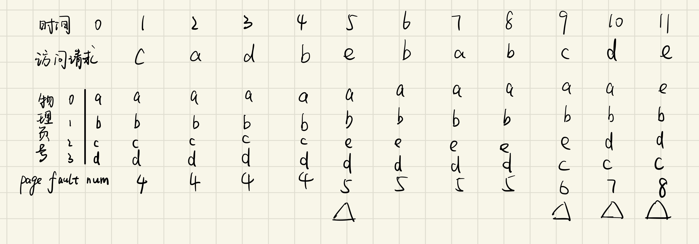
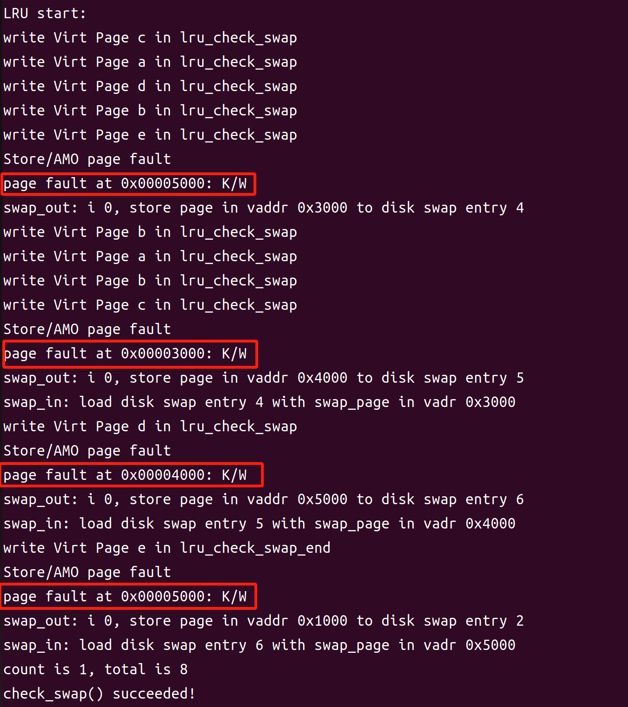

### LRU 页面置换算法的设计与实现

---

#### 实验设计与分析

1. **LRU 算法原理**
   
   ​	LRU 算法会优先将最近最少使用的页面置换出内存。每当页面被访问时，将其标记为最新使用。为了实现 LRU 算法，常见的方式是使用链表，将最近使用的页面放在链表头部，最久未使用的页面放在链表尾部，出现缺页时取走位于尾部的page。
   
2. **数据结构**
   
   - **链表节点**：页面使用链表节点 `list_entry_t` 结构进行管理，`list_entry_t` 为双向链表结构，具有 `next` 和 `prev` 指针，可便捷实现 LRU 页面在链表中的插入、删除等操作。
   - **链表头 `pra_list_head`**：用于存储 LRU 链表的头节点，表示最近使用的页面位置。
   - **页面映射指针 `sm_priv`**：在 `mm_struct` 结构中使用 `sm_priv` 指向 `pra_list_head`，以管理和访问 LRU 页面链表。
   
3. **核心功能设计**
   
   - **页面可交换标记** (`_lru_map_swappable`)：同FIFO一致，在页面被访问时，将其添加到链表头部，表示为最近访问的页面。
   - **页面移除** (`_lru_remove_page`)：实现页面删除，首先在链表中找到页面对应的节点，并将其从链表中移除。
   - **选择页面换出** (`_lru_swap_out_victim`)：同FIFO一致，选择链表尾部的节点（最久未访问的页面）作为换出页面。

---

#### 代码实现

##### 1. `_lru_init_mm`：初始化 LRU 链表

```c
static int _lru_init_mm(struct mm_struct *mm) {
    list_init(&pra_list_head);      // 初始化 LRU 链表的头节点
    mm->sm_priv = &pra_list_head;   // 将链表头部指针保存在 mm->sm_priv 中
    return 0;
}
```

- **功能**：初始化 LRU 链表，并将链表头部与内存管理结构 `mm_struct` 关联。
- **流程**：
  - 调用 `list_init` 初始化 `pra_list_head`。
  - 将 `mm_struct` 结构中的 `sm_priv` 指针指向 `pra_list_head`，便于在其他函数中通过 `mm->sm_priv` 访问 LRU 链表。
- **作用**：在 `mm_struct` 结构中保存 LRU 链表头部，使后续函数可轻松访问和操作链表。

---

##### 2. `_lru_map_swappable`：将页面添加到 LRU 链表头部

```c
static int _lru_map_swappable(struct mm_struct *mm, uintptr_t addr, struct Page *page, int swap_in) {
    list_entry_t *head = (list_entry_t *)mm->sm_priv;
    list_entry_t *entry = &(page->pra_page_link);
    assert(entry != NULL && head != NULL);

    list_add_after(head, entry); // 将页面插入链表头部
    return 0;
}
```

- **功能**：在页面被访问或加载时，将其添加到 LRU 链表头部。
- **流程**：
  - 使用 `list_add_after` 将 `entry`（页面对应的节点）插入到链表头部，表示该页面最近被访问。
- **作用**：保证最近访问的页面始终在链表头部，维持链表的顺序，以便在换出时直接从链表尾部获取最久未访问的页面。

---

##### 3. `_lru_swap_out_victim`：选择换出页面

```c
static int _lru_swap_out_victim(struct mm_struct *mm, struct Page **ptr_page, int in_tick) {
    list_entry_t *head = (list_entry_t *)mm->sm_priv;
    assert(head != NULL);
    assert(in_tick == 0);

    list_entry_t *entry = list_prev(head); // 找到链表尾部的页面
    if (entry != head) {
        list_del(entry);                     // 从链表中删除该页面
        *ptr_page = le2page(entry, pra_page_link); // 返回页面指针
    } else {
        *ptr_page = NULL;
    }
    return 0;
}
```

- **功能**：选择一个页面进行换出，依据 LRU 算法从链表尾部选择最久未使用的页面。
- **流程**：
  - 调用 `list_prev` 获取链表尾部页面节点（最久未访问的页面）。
  - 使用 `list_del` 将该页面从链表中移除。
  - 将 `ptr_page` 指向要被换出的页面。
- **作用**：确保换出的页面是链表中最久未使用的页面，实现 LRU 置换策略。

---

##### 4. `_lru_remove_page`：从 LRU 链表中删除页面并重新插入

```c
static void _lru_remove_page(struct mm_struct *mm, uintptr_t addr) {
    pte_t *ptep = get_pte(mm->pgdir, addr, 0);
    if (ptep == NULL || !(*ptep & PTE_V)) {
        cprintf("Page not found for addr: 0x%x\n", addr);
        return;
    }

    struct Page *page = pte2page(*ptep);
    list_entry_t *head = (list_entry_t *)mm->sm_priv;
    list_entry_t *entry = &(page->pra_page_link);

    // 检查页面是否在链表中
    list_entry_t *temp = head->next;
    while (temp != head) {
        if (temp == entry) {    // 如果找到了页面对应的节点
            list_del(entry);    // 从链表中删除该节点
            break;
        }
        temp = temp->next;
    }
    _lru_map_swappable(mm, addr, page, 0); // 重新插入链表头部
}
```

- **功能**：从 LRU 链表中删除指定的页面，然后将其重新插入到链表头部。
- **流程**：
  - 通过地址 `addr` 找到页面表项 `ptep`。
  - 检查页面是否有效且存在链表中。
  - 若页面存在，则从链表中删除该页面对应的节点。
  - 将页面重新插入到链表头部，以更新其为最新使用。
- **作用**：维护页面在链表中的顺序，确保最近访问的页面始终位于链表头部。

---

#### 代码测试

模拟对虚拟页面的访问，**每次访问后调用 `_lru_remove_page` 以更新链表中页面的顺序。**

```c
static int
_lru_check_swap(void) {
    cprintf("LRU start:\n");
    cprintf("write Virt Page c in lru_check_swap\n");
    *(unsigned char *)0x3000 = 0x0c;
     _lru_remove_page(check_mm_struct, 0x3000);
    assert(pgfault_num==4);
    cprintf("write Virt Page c in lru_check_swap\n");
    *(unsigned char *)0x1000 = 0x0a;
     _lru_remove_page(check_mm_struct, 0x1000);
    assert(pgfault_num==4);
    cprintf("write Virt Page a in lru_check_swap\n");
    *(unsigned char *)0x4000 = 0x0d;
     _lru_remove_page(check_mm_struct, 0x4000);
    assert(pgfault_num==4);
    cprintf("write Virt Page b in lru_check_swap\n");
    *(unsigned char *)0x2000 = 0x0b;
     _lru_remove_page(check_mm_struct, 0x2000);
    assert(pgfault_num==4);
    cprintf("write Virt Page e in lru_check_swap\n");
    *(unsigned char *)0x5000 = 0x0e;
     _lru_remove_page(check_mm_struct, 0x5000);
    assert(pgfault_num==5);
    cprintf("write Virt Page b in lru_check_swap\n");
    *(unsigned char *)0x2000 = 0x0b;
     _lru_remove_page(check_mm_struct, 0x2000);
    assert(pgfault_num==5);
    cprintf("write Virt Page a in lru_check_swap\n");
    *(unsigned char *)0x1000 = 0x0a;
     _lru_remove_page(check_mm_struct, 0x1000);
    assert(pgfault_num==5);
    cprintf("write Virt Page b in lru_check_swap\n");
    *(unsigned char *)0x2000 = 0x0b;
     _lru_remove_page(check_mm_struct, 0x2000);
    assert(pgfault_num==5);
    cprintf("write Virt Page c in lru_check_swap\n");
    *(unsigned char *)0x3000 = 0x0c;
     _lru_remove_page(check_mm_struct, 0x3000);
    assert(pgfault_num==6);
    cprintf("write Virt Page d in lru_check_swap\n");
    *(unsigned char *)0x4000 = 0x0d;
     _lru_remove_page(check_mm_struct, 0x4000);
    assert(pgfault_num==7);
    cprintf("write Virt Page e in lru_check_swap_end\n");
    *(unsigned char *)0x5000 = 0x0e;
     _lru_remove_page(check_mm_struct, 0x5000);
    assert(pgfault_num==8);
   
    
    return 0;
}
```

测试过程和预期结果如图所示：



**此访问序列共缺页8次，分别是初始缺页4次，e(0x5000),c(0x3000),d(0x4000),e(0x5000)**。

### 实验结果

在测试中验证了 LRU 置换算法的正确性，测试函数 `_lru_check_swap` 确认页面缺页次数和访问顺序**均符合 LRU 逻辑**。



---

#### 总结

本实验实现了基于双向链表的 LRU 页面置换算法，通过设置链表头部和尾部来标记页面的使用顺序，实现了页面的高效管理。测试结果表明，LRU 算法正确维护了页面访问顺序。