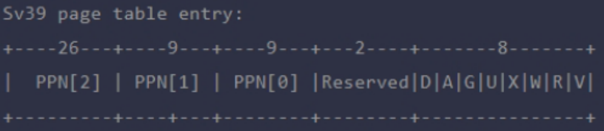

# **练习1：理解基于FIFO的页面替换算法**
## 题目
描述FIFO页面置换算法下，一个页面从被换入到被换出的过程中，会经过代码里哪些函数/宏的处理（或者说，需要调用哪些函数/宏），并用简单的一两句话描述每个函数在过程中做了什么？（为了方便同学们完成练习，所以实际上我们的项目代码和实验指导的还是略有不同，例如我们将FIFO页面置换算法头文件的大部分代码放在了kern/mm/swap_fifo.c文件中，这点请同学们注意）
+ 至少正确指出10个不同的函数分别做了什么？如果少于10个将酌情给分。我们认为只要函数原型不同，就算两个不同的函数。要求指出对执行过程有实际影响,删去后会导致输出结果不同的函数（例如assert）而不是cprintf这样的函数。如果你选择的函数不能完整地体现”从换入到换出“的过程，比如10个函数都是页面换入的时候调用的，或者解释功能的时候只解释了这10个函数在页面换入时的功能，那么也会扣除一定的分数
## 答案
（1）虚拟内存管理初始化的相关文件/函数和对应功能
vmm_init：建立虚拟内存到物理内存的映射关系
ide_init：初始化swap硬盘
swap_init：初始化页面置换算法
（2）触发缺页异常
trap.c/pgfault_handler()：触发缺页异常时，内核会调用该函数去处理，该函数会调用相关函数，其另外做的事情只是输出缺页提示信息。
（3）处理缺页异常
vmm.c/do_pgfault()：定义了缺页异常处理的主要逻辑行为
其中包括：
+ 检查虚拟地址合法性
  vmm.c/find_vma()：检查请求虚拟地址是否满足实际虚拟地址范围，然后查找该虚拟地址是否真实存在
+ 找到/创建页表项
  pmm.c/get_pte()：根据虚拟地址和页目录表来获取对应的页表项。当一级页表和二级页表不存在时需要创建它们。
+ 换入
  swap.c\swap_in(struct mm_struct *mm, uintptr_t addr, struct Page **ptr_result)：分配一个空闲的物理页面，再根据虚拟地址获取到对应的页表项，在页表项的信息，从磁盘中读取数据到物理页面当中。
  + alloc_page() 分配页面，当做内存页，用来存储从磁盘上读取的数据
  + assert(result!=NULL) 确保要分配到页面，否则后续没法将磁盘上的数据转移到内存
  + get_pte(mm->pgdir,addr,0) 根据传入的la在不创建页表项的情况下，找到la所对应的页表项，并返回其内核虚拟地址
  + swapfs_read((*ptep),result)!=0 将数据从磁盘读取到内存，并确保读取正确
  + swap.c/swap_out() 必要时换出页面
+ 基于FIFO的页面替换
  _fifo_swap_out_victim(struct mm_struct *mm, struct Page ** ptr_page, int in_tick)：确保不在时钟中断处理中调用该函数时，获取FIFO队列中最早进入的页面，删除。
  + assert(head!=NULL) 确保head=(list_entry_t*) mm->sm_priv,因此要确保是存在链表头的
  + assert(in_tick==0) in_tick =0时，代表不是在时钟中断处理函数中调用的该函数
  + list_entry_t* entry = list_prev(head) 双向链表中，获取头结点的前一个节点
  + list_del(entry) 对于选区中的页面，从链表中删除！
+ 换出
  swap.c\swap_out(struct mm_struct *mm, int n, int in_tick)：对于要换出n页，执行n轮次如下操作：利用 ss->swap_out_victim 寻找受害页，如果找到受害页，根据其虚拟地址，得到对应的页表项。将物理页上的内容以扇区为单位填写至磁盘当中，最后更新TLB
  + swap_out_victim(mm,&page,in_tick) 在本题目当中，是利用FIFO算法寻找换页牺牲者
  + get_pte(mm->pgdir,v,0) 获取到牺牲页v的内核虚拟地址
  + assert((*ptep & PTE_V)!=0) 确保这个页是有效的
  + swapfs_write((page->pra_vaddr/PGSIZE+1)<<8, page) 以扇区为单位将牺牲页上的数据写到磁盘上的对应位置。
  + tlb_invalidate(mm->pgdir,v) 刷新TLB快表，使TLB有效

# 练习 2：深入理解不同分页模式的工作原理（思考题）

`get_pte()` 函数（位于 `kern/mm/pmm.c`）用于在页表中查找或创建页表项，从而实现对指定线性地址对应的物理页的访问和映射操作。这在操作系统中的分页机制下，是实现虚拟内存与物理内存之间映射关系非常重要的内容。

## 代码分析

`get_pte()` 函数中有两段形式类似的代码，结合 `sv32`、`sv39`、`sv48` 的异同，解释这两段代码为什么如此相像。

相似代码如下：

```c
pde_t *pdep1 = &pgdir[PDX1(la)];

if (!(*pdep1 & PTE_V)) {
    // Allocate a page for the second level page table (if create is true)
}

pde_t *pdep0 = &((pde_t *)KADDR(PDE_ADDR(*pdep1)))[PDX0(la)];

if (!(*pdep0 & PTE_V)) {
    // Allocate a page for the third level page table (if create is true)
}

return &((pte_t *)KADDR(PDE_ADDR(*pdep0)))[PTX(la)];
```

这段代码的目的是获取线性地址 `la` 对应的页表项的地址。代码首先计算了对应的一级页表项（PDE1）的地址，并检查其是否有效（通过 `PTE_V` 标志）。如果一级页表项无效，说明对应的二级页表不存在，需要为其分配一个页面。

接着，代码计算了二级页表项（PDE0）的地址，同样检查其是否有效。如果二级页表项无效，说明对应的三级页表不存在，需要为其分配一个页面。

最后，代码通过计算得到的页表项地址，返回对应的页表项指针。无论是在 `sv32`、`sv39` 还是 `sv48` 的情况下，页表的基本结构是类似的。每个页表级别（一级页表和二级页表）都由相应的目录项（PDE）和页表项（PTE）组成。这意味着相似的操作逻辑可以用于不同的页表级别。

而这两段代码的主要区别在于，第一段代码的开始部分为：

```c
pde_t *pdep1 = &pgdir[PDX1(la)];
```

第二段代码的开始部分为：

```c
pde_t *pdep0 = &((pde_t *)KADDR(PDE_ADDR(*pdep1)))[PDX0(la)];
```

这两句代码都是用于获取第一级页目录项（PDE）的地址，但第二段它在前面加了一些转换操作 `KADDR(PDE_ADDR(...))`，此函数在 `sv32` 中用于将物理地址转换为内核虚拟地址。而在 `sv39` 和 `sv48` 中，地址转换会更复杂，因为涉及到了更多的层次和表项。

## 是否需要将查找和分配操作拆开？

目前 `get_pte()` 函数将页表项的查找和页表项的分配合并在一个函数里。你认为这种写法好吗？有没有必要把两个功能拆开？

查找 PTE 和分配 PTE 是密切相关的操作。所以将它们合并在一起会有以下好处：

1. **保持逻辑一致性**：将它们合并在一个函数中可以保持逻辑一致性，使得代码更容易理解和维护。

2. **简化接口调用，减少函数调用开销**：将两者合并可以简化对页表的操作，用户只需要调用一个函数就能完成查找或分配页表项的操作。这样做可以减少用户调用的复杂度。

3. **减少代码的冗余**：查找和分配页表项的内部实现可能涉及到相似的逻辑和数据结构，合并在一起可以更好地共享内部实现，减少代码的冗余。

然而，在一些复杂的操作系统或需要更灵活的内存管理场景下，还是要将查找和分配分成两个独立的函数，以便更好地控制内存管理的细节。这取决于具体的实践需求。

# **练习3：给未被映射的地址映射上物理页（需要编程）**
## 题目
补充完成do_pgfault（mm/vmm.c）函数，给未被映射的地址映射上物理页。设置访问权限的时候需要参考页面所在 VMA 的权限，同时需要注意映射物理页时需要操作内存控制结构所指定的页表，而不是内核的页表。
请在实验报告中简要说明你的设计实现过程。请回答如下问题：
+ 请描述页目录项（Page Directory Entry）和页表项（Page Table Entry）中组成部分对ucore实现页替换算法的潜在用处。
+ 如果ucore的缺页服务例程在执行过程中访问内存，出现了页访问异常，请问硬件要做哪些事情？
  + 数据结构Page的全局变量（其实是一个数组）的每一项与页表中的页目录项和页表项有无对应关系？如果有，其对应关系是啥？
## 答案
代码修改如下
```c
if (*ptep == 0) {
        if (pgdir_alloc_page(mm->pgdir, addr, perm) == NULL) {
            cprintf("pgdir_alloc_page in do_pgfault failed\n");
            goto failed;
        }
    } else {
        /*LAB3 EXERCISE 3: YOUR CODE
        * 请你根据以下信息提示，补充函数
        * 现在我们认为pte是一个交换条目，那我们应该从磁盘加载数据并放到带有phy addr的页面，
        * 并将phy addr与逻辑addr映射，触发交换管理器记录该页面的访问情况
        *
        *  一些有用的宏和定义，可能会对你接下来代码的编写产生帮助(显然是有帮助的)
        *  宏或函数:
        *    swap_in(mm, addr, &page) : 分配一个内存页，然后根据
        *    PTE中的swap条目的addr，找到磁盘页的地址，将磁盘页的内容读入这个内存页
        *    page_insert ： 建立一个Page的phy addr与线性addr la的映射
        *    swap_map_swappable ： 设置页面可交换
        */
        if (swap_init_ok) {
            struct Page *page = NULL;
            // 你要编写的内容在这里，请基于上文说明以及下文的英文注释完成代码编写
            //（1）According to the mm AND addr, try
            //to load the content of right disk page
            //into the memory which page managed.
            swap_in(mm, addr, &page);
            //(2) According to the mm,
            //addr AND page, setup the
            //map of phy addr <--->
            //logical addr
            page_insert(mm->pgdir, page, addr, perm); // 建立虚拟地址和物理地址之间的对应关系(更新 PTE 因为已经被换入到内存中了)
            //(3) make the page swappable.
            swap_map_swappable(mm, addr, page, 0); // 使这一页可以置换
            page->pra_vaddr = addr;
        } else {
            cprintf("no swap_init_ok but ptep is %x, failed\n", *ptep);
            goto failed;
        }
    }
```
设计思路：do_pgfault函数处理缺⻚异常情况，其在出现异常根据scause寄存器中的两个分类CAUSE_LOAD_PAGE_FAULT和CAUSE_STORE_PAGE_FAULT时被exception_handler下的pgfault_handler 调⽤，⽤来尝试进⾏⻚⾯替换。
设计实现过程：

1. 调⽤swap_in()函数将⼀个磁盘⻚调到内存中，⽤mm_struct*mm和addr作为参数调⽤构建该虚拟地址对应的⻚表项，并通过alloc_page() 分配物理⻚和get_pte 查找/swapfs_read() （本质上是memcpy）将数据从硬盘读到内存⻚result中，&page利⽤传参完成赋值，保存换⼊的物理⻚⾯。
2. 调⽤page_insert 函数更新⻚表/插⼊新的⻚表项并刷新TLB，将换⼊的物理⻚添加虚拟⻚映射。在page_insert 中还是先找该虚拟地址对应的⻚表项，如果valid（说明这地⽅有个PTE）则检查该⻚是否和要插⼊的⻚相同；最后调⽤*ptep = pte_create(page2ppn(page), PTE_V | perm) 建⽴该⻚对应的PTE。
3. 设置该⻚⾯可交换，找到swap.c中的swap_map_swappable 函数，设置好对应参数即可调⽤
+ Q1·页目录项（Page Directory Entry）和页表项（Page Table Entry）中组成部分对ucore实现页替换算法的潜在用处
  实现⻚替换算法函数的关键参数主要是struct mm_struct* mm，该结构体把⼀个⻚表对应的信息组合起来，包括按虚拟地址⼤⼩排序的线性表mmap_list，vma_struct链表⾸指针mmap_cache，对应的⻚表在内存⾥的指针pgdir，vma_struct链表的元素个数map_count和给swapmanager应⽤的私有数据void* sm_priv。通过struct mm_struct* mm和39位虚拟地址addr，我们能调⽤get_pte()查找某个虚拟地址对应的⻚表项，如果不存在这个⻚表项，会为它分配各级的⻚表；同理，swap.c中的swap_in，swap_out函数的重要参数之⼀都是mm；实现clock⻚替换算法⽂件swap_clock.c中的初始函数、⻚⾯插⼊和排除函数也要⽤到mm->sm_priv。
  + PDE和PTE的宏和相关判断：
```c
// 计算PDX1,0的下标
 
#define PDX1(la) ((((uintptr_t)(la)) >> PDX1SHIFT) & 0x1FF)
#define PDX0(la) ((((uintptr_t)(la)) >> PDX0SHIFT) & 0x1FF)
// page table index
#define PTX(la) ((((uintptr_t)(la)) >> PTXSHIFT) & 0x1FF)
// page table entry (PTE) 相关字段值
 
#define PTE_V     0x001 // Valid
#define PTE_R     0x002 // Read
#define PTE_W     0x004 // Write
#define PTE_X     0x008 // Execute
#define PTE_U     0x010 // Use
```
  以上通过对虚拟地址la的位移和与操作进⾏⻚⽬录项和⻚表项下标的计算。
  + 调⽤get_pte查找，分配⻚表项的时候对PDX1,PDX0和PTE做的判断：
```c
//get_pte查找某个虚拟地址对应的⻚表项，如果不存在这个⻚表项，会为它分配各级的⻚表
 
pte_t *get_pte(pde_t *pgdir, uintptr_t la, bool create) {
    pde_t *pdep1 = &pgdir[PDX1(la)];//找到对应的Giga Page 
    if (!(*pdep1 & PTE_V)) {
    //如果下⼀级⻚表不存在，那就给它分配⼀⻚，创造新⻚表
 
        struct Page *page;
        if (!create || (page = alloc_page()) == NULL) {
            return NULL;
        }
        set_page_ref(page, 1);
        uintptr_t pa = page2pa(page);
        memset(KADDR(pa), 0, PGSIZE);
        *pdep1 = pte_create(page2ppn(page), PTE_U | PTE_V);
        //注意这⾥R,W,X全零
 
    }
    pde_t *pdep0 = &((pde_t *)KADDR(PDE_ADDR(*pdep1)))[PDX0(la)];
    //再下⼀级⻚表（更多可能是⻚⽬录）
 
    if (!(*pdep0 & PTE_V)) {
    //思路同上，建⽴⻚表
 
        struct Page *page;
        if (!create || (page = alloc_page()) == NULL) {
            return NULL;
        }
        set_page_ref(page, 1);
        uintptr_t pa = page2pa(page);
        memset(KADDR(pa), 0, PGSIZE);
        *pdep0 = pte_create(page2ppn(page), PTE_U | PTE_V);
    }
    return &((pte_t *)KADDR(PDE_ADDR(*pdep0)))[PTX(la)];
 }
```
  通过预先的宏定义加速了判断，并使得代码逻辑清晰。
  + 通过pgdir_alloc_page快速给对应的PTE分配Page：
```c
struct Page *pgdir_alloc_page(pde_t *pgdir, uintptr_t la, uint32_t perm) {
    struct Page *page = alloc_page();
    if (page != NULL) {
        if (page_insert(pgdir, page, la, perm) != 0) {
            free_page(page);
            return NULL;
        }
        if (swap_init_ok) {
            swap_map_swappable(check_mm_struct, la, page, 0);
            page->pra_vaddr = la;
            assert(page_ref(page) == 1);
        }
    }
 }
 return page;
```
  通过调⽤alloc_page和page_insert两个函数⽤参数PDE分配对应的⻚⾯，更⾼⼀层的抽象带来更好的简洁性。

  **潜在功能**
  页目录项（Page Directory Entry）和页表项（Page Table Entry）中的组成部分可以用于实现页替换算法。在sv39中，页表项的结构如下：

  其中的字段可以分为两部分：用于查找页号的字段和用于权限设置的字段。其中，关于权限设置的字段可以记录页面的访问情况、页面的修改状态、页面的使用频率等信息，从而为页替换算法提供更多的依据和参考。比如，do_pgfault中，就利用了页表项的权限字段。具体来说，在设置perm的值的时候，就使用到了用于权限设置的字段。

+ Q2·如果ucore的缺页服务例程在执⾏过程中访问内存，出现了页访问异常，请问硬件要做哪些事情？
  当 ucore 的缺页服务例程在执行过程中访问内存出现页访问异常时，硬件执行以下操作：
  1.异常检测与保存状态：
  + CPU 在访问虚拟地址时，如果无法找到对应的物理地址映射关系（如该页没有被加载到内存中）或访问权限不一致（如没有适当的读写权限），会触发缺页异常（page fault）。
  + 硬件会将异常类型（页访问异常）设置并保存当前程序的状态/上下文信息，例如程序计数器（PC）、各个寄存器的值等。
  2.跳转到操作系统的异常处理程序：
  + 硬件将控制权转交给操作系统，进入操作系统的异常处理流程。在 ucore 中，这一过程会进入 trapentry.S 中，保存上下文后跳转到 trap.c 文件中的pgfault_handler 函数。
  3.异常处理：
  + 在 trap.c 文件中，pgfault_handler 会调用 do_pgfault 函数进行缺页异常的具体处理。
  + do_pgfault 中，会根据异常发生的虚拟地址（即 stval 存储的地址）查找对应的虚拟内存区域（VMA），获取该区域的权限信息。
  + 接下来，代码会根据对齐后的地址检查并查找相应的页表项（PTE）。如果该页表项不存在，则会立即创建一个新的页表项。
  + 找到页表项后，操作系统会将该页面加载到内存中，建立虚拟地址与物理地址的映射，并将该页面设置为可被交换的状态。
  4.恢复执行：
  + 完成缺页处理后，操作系统会通过修改上下文信息恢复原来的程序状态，跳回发生异常的指令位置，重新执行该指令。
+ Q3·数据结构Page与⻚表的关系：
  Page结构体的组成：
```c
   struct Page {
       int ref;                        // page frame's reference counter
       uint_t flags;                   // array of flags that describe the status of the page frame
       uint_t visited;                 //为clock新增
       unsigned int property;          // the num of free block, used in first fit pm manager
       list_entry_t page_link;         // free list link
       list_entry_t pra_page_link;     // used for pra (page replace algorithm)
       uintptr_t pra_vaddr;            // used for pra (page replace algorithm)
   };
```
  其中的pra_vaddr就是这个页所对应的虚拟地址。根据这个地址，我们就可以知道其对应的页目录项和页表项。Page数组的索引（表示一个内存页）对应页表项的索引，而Page数组的每一项中存储了该页表项对应的物理页的相关信息，比如物理地址、引用计数、是否在交换区等。这样可以通过Page数组来管理和跟踪物理页的状态和使用情况。

# 练习5 阅读代码和实现手册，理解页表映射方式相关知识（思考题）

> 如果我们采用”一个大页“ 的页表映射方式，相比分级页表，有什么好处、优势，有什么坏处、风险？

### 一、采用“一个大页”映射的好处和优势

1. **减少页表项的数量和内存开销**：
   - 使用一个大页将一大块连续的虚拟地址空间映射到物理内存，只需要一个页表项即可。相比于分级页表的多级结构，大页表可以极大地减少页表项的数量，从而减少内存消耗。
2. **提高TLB命中率**：
   - TLB 用于缓存虚拟地址到物理地址的映射。如果映射关系采用一个大页表示，那么在访问大页中的任意地址时，TLB 只需要缓存一个条目就可以完成整个大页的地址转换。这种方式减少了需要加载到 TLB 的条目数量，提高了 TLB 命中率。更高的 TLB 命中率可以减少页表查找的开销，从而提升访问内存的速度和整体性能。
3. **加快内存映射的速度**：
   - 一个大页的映射减少了页表的层次和需要遍历的页表项数量，从而简化了内存映射的过程。尤其是在系统启动或加载大块内存时，这种方式可以显著加快内存映射的速度。
4. **简化页表管理**：
   - 分级页表需要复杂的页表管理和内存分配机制，而使用一个大页映射可以简化页表的管理。操作系统在为进程分配大块内存时可以一次性完成映射，而不需要为每个小页分别分配页表和设置页表项。

| **优点**         | **描述**                                               |
| ---------------- | ------------------------------------------------------ |
| 减少页表项数量   | 大页映射仅需一个页表项，减少内存消耗和页表管理复杂性。 |
| 提高 TLB 命中率  | 大页映射减少了 TLB 的缓存条目数量，提高了访问效率。    |
| 加快内存映射速度 | 简化了内存映射过程，尤其是启动或加载大块内存时。       |
| 简化页表管理     | 一次性映射大块内存，无需管理分级页表中的多个小页表。   |

### 二、采用“一个大页”映射的坏处和风险

1. **内存浪费（内部碎片问题）**：
   - 使用大页映射时，页的大小通常是固定的（例如 2MB 或 1GB）。如果要映射的内存块不能完全填满一个大页，就会造成内部碎片，导致内存浪费。例如，只需要 1MB 的内存却映射了一个 2MB 的大页，其中未使用的 1MB 内存将被浪费。
2. **缺乏灵活性，无法精细控制权限**：
   - 分级页表允许对每个小页面单独设置访问权限和属性，而大页映射的粒度较大，无法对其中的某一小部分单独设置权限。这意味着，如果需要对大页中的某一段内存进行保护（如设置为只读或禁止访问），需要对整个大页进行相同的权限设置，导致灵活性不足。
3. **缺乏对细粒度地址空间的支持**：
   - 在需要频繁访问小块内存、并且内存布局较为复杂的场景下，大页映射可能不合适。大页映射无法提供对小块内存的单独控制，导致地址空间的布局不灵活。
4. **不利于页面置换**：
   - 在分级页表中，系统可以针对每个小页进行页面置换（将不常用的页面换出到磁盘），从而更高效地使用物理内存。然而，使用大页映射时，系统无法对大页中的一小部分内存单独进行置换。如果要换出大页中的某部分内容，只能换出整个大页，降低了页面置换的效率。这会导致大页映射的内存占用始终处于较高水平，不利于内存紧张环境下的资源管理。

| **缺点**             | **描述**                                               |
| -------------------- | ------------------------------------------------------ |
| 内存浪费             | 可能因未使用的空间产生内部碎片，导致内存浪费。         |
| 灵活性不足           | 无法对大页中的小块内存单独设置权限，缺乏精细控制。     |
| 不支持细粒度地址空间 | 动态分配和管理小块内存时不灵活，不适用于复杂内存布局。 |
| 不利于页面置换       | 无法单独置换大页中的一小部分内容，降低了置换效率       |