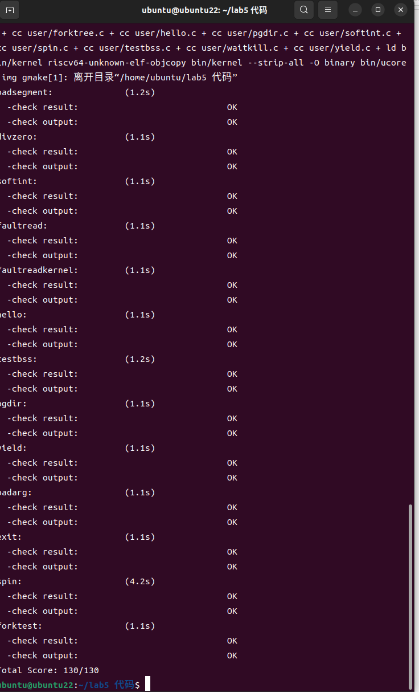
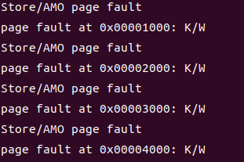
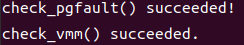
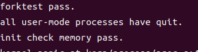
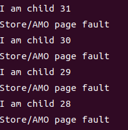

## 练习一：加载应用程序并执行（需要编码）

> **do_execv**函数调用`load_icode`（位于kern/process/proc.c中）来加载并解析一个处于内存中的ELF执行文件格式的应用程序。你需要补充`load_icode`的第6步，建立相应的用户内存空间来放置应用程序的代码段、数据段等，且要设置好`proc_struct`结构中的成员变量trapframe中的内容，确保在执行此进程后，能够从应用程序设定的起始执行地址开始执行。需设置正确的trapframe内容。
>
> 请在实验报告中简要说明你的设计实现过程。
>
> - 请简要描述这个用户态进程被ucore选择占用CPU执行（RUNNING态）到具体执行应用程序第一条指令的整个经过。

```c
static int
load_icode(unsigned char *binary, size_t size) {
    if (current->mm != NULL) {
        panic("load_icode: current->mm must be empty.\n");
    }

    int ret = -E_NO_MEM;
    struct mm_struct *mm;
    //(1) create a new mm for current process
    if ((mm = mm_create()) == NULL) {
        goto bad_mm;
    }
    //(2) create a new PDT, and mm->pgdir= kernel virtual addr of PDT
    if (setup_pgdir(mm) != 0) {
        goto bad_pgdir_cleanup_mm;
    }
    //(3) copy TEXT/DATA section, build BSS parts in binary to memory space of process
    struct Page *page;
    //(3.1) get the file header of the bianry program (ELF format)
    struct elfhdr *elf = (struct elfhdr *)binary;
    //(3.2) get the entry of the program section headers of the bianry program (ELF format)
    struct proghdr *ph = (struct proghdr *)(binary + elf->e_phoff);
    //(3.3) This program is valid?
    if (elf->e_magic != ELF_MAGIC) {
        ret = -E_INVAL_ELF;
        goto bad_elf_cleanup_pgdir;
    }

    uint32_t vm_flags, perm;
    struct proghdr *ph_end = ph + elf->e_phnum;
    for (; ph < ph_end; ph ++) {
    //(3.4) find every program section headers
        if (ph->p_type != ELF_PT_LOAD) {
            continue ;
        }
        if (ph->p_filesz > ph->p_memsz) {
            ret = -E_INVAL_ELF;
            goto bad_cleanup_mmap;
        }
        if (ph->p_filesz == 0) {
            // continue ;
        }
    //(3.5) call mm_map fun to setup the new vma ( ph->p_va, ph->p_memsz)
        vm_flags = 0, perm = PTE_U | PTE_V;
        if (ph->p_flags & ELF_PF_X) vm_flags |= VM_EXEC;
        if (ph->p_flags & ELF_PF_W) vm_flags |= VM_WRITE;
        if (ph->p_flags & ELF_PF_R) vm_flags |= VM_READ;
        // modify the perm bits here for RISC-V
        if (vm_flags & VM_READ) perm |= PTE_R;
        if (vm_flags & VM_WRITE) perm |= (PTE_W | PTE_R);
        if (vm_flags & VM_EXEC) perm |= PTE_X;
        if ((ret = mm_map(mm, ph->p_va, ph->p_memsz, vm_flags, NULL)) != 0) {
            goto bad_cleanup_mmap;
        }
        unsigned char *from = binary + ph->p_offset;
        size_t off, size;
        uintptr_t start = ph->p_va, end, la = ROUNDDOWN(start, PGSIZE);

        ret = -E_NO_MEM;

     //(3.6) alloc memory, and  copy the contents of every program section (from, from+end) to process's memory (la, la+end)
        end = ph->p_va + ph->p_filesz;
     //(3.6.1) copy TEXT/DATA section of bianry program
        while (start < end) {
            if ((page = pgdir_alloc_page(mm->pgdir, la, perm)) == NULL) {
                goto bad_cleanup_mmap;
            }
            off = start - la, size = PGSIZE - off, la += PGSIZE;
            if (end < la) {
                size -= la - end;
            }
            memcpy(page2kva(page) + off, from, size);
            start += size, from += size;
        }

      //(3.6.2) build BSS section of binary program
        end = ph->p_va + ph->p_memsz;
        if (start < la) {
            /* ph->p_memsz == ph->p_filesz */
            if (start == end) {
                continue ;
            }
            off = start + PGSIZE - la, size = PGSIZE - off;
            if (end < la) {
                size -= la - end;
            }
            memset(page2kva(page) + off, 0, size);
            start += size;
            assert((end < la && start == end) || (end >= la && start == la));
        }
        while (start < end) {
            if ((page = pgdir_alloc_page(mm->pgdir, la, perm)) == NULL) {
                goto bad_cleanup_mmap;
            }
            off = start - la, size = PGSIZE - off, la += PGSIZE;
            if (end < la) {
                size -= la - end;
            }
            memset(page2kva(page) + off, 0, size);
            start += size;
        }
    }
    //(4) build user stack memory
    vm_flags = VM_READ | VM_WRITE | VM_STACK;
    if ((ret = mm_map(mm, USTACKTOP - USTACKSIZE, USTACKSIZE, vm_flags, NULL)) != 0) {
        goto bad_cleanup_mmap;
    }
    assert(pgdir_alloc_page(mm->pgdir, USTACKTOP-PGSIZE , PTE_USER) != NULL);
    assert(pgdir_alloc_page(mm->pgdir, USTACKTOP-2*PGSIZE , PTE_USER) != NULL);
    assert(pgdir_alloc_page(mm->pgdir, USTACKTOP-3*PGSIZE , PTE_USER) != NULL);
    assert(pgdir_alloc_page(mm->pgdir, USTACKTOP-4*PGSIZE , PTE_USER) != NULL);
    
    //(5) set current process's mm, sr3, and set CR3 reg = physical addr of Page Directory
    mm_count_inc(mm);
    current->mm = mm;
    current->cr3 = PADDR(mm->pgdir);
    lcr3(PADDR(mm->pgdir));

    //(6) setup trapframe for user environment
    struct trapframe *tf = current->tf;
    // Keep sstatus
    uintptr_t sstatus = tf->status;
    memset(tf, 0, sizeof(struct trapframe));
    /* LAB5:EXERCISE1 2213130
     * should set tf->gpr.sp, tf->epc, tf->status
     * NOTICE: If we set trapframe correctly, then the user level process can return to USER MODE from kernel. So
     *          tf->gpr.sp should be user stack top (the value of sp)
     *          tf->epc should be entry point of user program (the value of sepc)
     *          tf->status should be appropriate for user program (the value of sstatus)
     *          hint: check meaning of SPP, SPIE in SSTATUS, use them by SSTATUS_SPP, SSTATUS_SPIE(defined in risv.h)
     */

    tf->gpr.sp = USTACKTOP;
    tf->epc = elf->e_entry;
    // sstatus &= ~SSTATUS_SPP;
    // sstatus &= SSTATUS_SPIE;
    // tf->status = sstatus;
    tf->status = sstatus & ~(SSTATUS_SPP | SSTATUS_SPIE);
    ret = 0;
out:
    return ret;
bad_cleanup_mmap:
    exit_mmap(mm);
bad_elf_cleanup_pgdir:
    put_pgdir(mm);
bad_pgdir_cleanup_mm:
    mm_destroy(mm);
bad_mm:
    goto out;
}
```

Load_icode函数主要是把新的程序加载到当前进程里，其实现一共分为6步：

##### 第一步：创建新的内存管理结构（`mm`）

首先检查当前进程的内存管理结构 `current->mm` 是否为空。接着为当前进程创建一个新的内存管理结构 `mm`。如果创建失败，函数会跳到错误处理部分。

##### 第二步：创建新的页目录

为当前进程设置页目录，并将 `mm->pgdir` 设置为新的页目录的虚拟地址。页目录是虚拟地址到物理地址的映射结构，用于虚拟内存的管理。如果页目录创建失败，函数会跳转到错误清理部分。

##### 第三步：解析 ELF 文件并加载程序段

1. **解析 ELF 文件头**：获取 ELF 文件的程序头。
2. **验证 ELF 文件的有效性**：确认它是一个有效的 ELF 文件。
3. **加载程序段**：遍历 ELF 文件中的程序头，识别需要加载到内存中的程序段（如 `.text`、`.data`）。然后，按需为每个程序段分配内存，并将段内容复制到内存中。
4. **处理 BSS 段**：对于未初始化的数据段（BSS 段），分配内存并将其清零。

##### 第四步：建立用户栈

栈区域是进程的用户内存空间的一部分，通常用于函数调用时保存返回地址和局部变量。这里设置栈的大小，并通过 `mm_map` 映射到虚拟内存。栈顶的地址为 `USTACKTOP`，并且分配了多个页面作为栈空间。

##### 第五步：设置当前进程的内存管理结构和页目录

1. **更新进程的 `mm`**：设置当前进程的内存管理结构（`current->mm`）为新的 `mm`。
2. **更新 CR3 寄存器**：将 `CR3` 寄存器设置为当前进程页目录的物理地址，CR3 寄存器指向当前进程的页表。使用 `lcr3` 指令更新 CR3 寄存器，切换到当前进程的页目录。

##### 第六步：设置Trapframe

为了确保用户程序能够正确地从内核模式返回到用户模式。Trapframe保存了程序执行时的状态，包括程序计数器、堆栈指针、状态寄存器等。

1. **设置堆栈指针**（`tf->gpr.sp`）为用户栈顶 `USTACKTOP`。
2. **设置程序计数器**（`tf->epc`）为 ELF 文件中的入口地址（`e_entry`），表示回到用户态后直接执行入口处的指令。
3. **设置状态寄存器**（`tf->status`）以确保从内核模式正确切换到用户模式，清除 `SSTATUS_SPP` 和 `SSTATUS_SPIE` 标志，因为在kernel_execve中，ebreak后SPP被设置为1，如果不清除就会跳转到内核态。

#### Q：请简要描述这个用户态进程被ucore选择占用CPU执行（RUNNING态）到具体执行应用程序第一条指令的整个经过。

在`do_execve()` `load_icode()`里面构建了用户程序运行的上下文，并使用ebreak完成上下文切换后，第一个内核进程initproc就会按照用户态到内核态系统调用的路径进行返回，并且执行中断返回指令iret，由于`tf->epc`为 ELF 文件中的入口地址`e_entry`，在返回后，用户态中的epc即为将要执行程序的入口地址。下一条要执行的指令即是应用程序第一条指令。

## 练习二

```c
uintptr_t* src = page2kva(page);
uintptr_t* dst = page2kva(npage);
memcpy(dst, src, PGSIZE);
ret = page_insert(to, npage, start, perm);
```

> 首先获取源地址和目的地址对应的内核虚拟地址，然后拷贝内存，最后将拷贝完成的页插入到页表中。

- cow设计见challenge1

## 练习三

### 函数的分析

1. `fork`：通过发起系统调用执行`do_fork`函数。用于创建并唤醒线程，可以通过`sys_fork`或者`kernel_thread`调用。
   + 初始化一个新线程
   + 为新线程分配内核栈空间
   + 为新线程分配新的虚拟内存或与其他线程共享虚拟内存
   + 获取原线程的上下文与中断帧，设置当前线程的上下文与中断帧
   + 将新线程插入哈希表和链表中
   + 唤醒新线程
   + 返回线程`id`
2. `exec`：通过发起系统调用执行`do_execve`函数。用于创建用户空间，加载用户程序，可以通过`sys_exec`调用。
   + 回收当前线程的虚拟内存空间
   + 为当前线程分配新的虚拟内存空间并加载应用程序
3. `wait`：通过发起系统调用执行`do_wait`函数。用于等待线程完成，可以通过`sys_wait`或者`init_main`调用。
   + 查找状态为`PROC_ZOMBIE`的子线程；如果查询到拥有子线程的线程，则设置线程状态并切换线程；如果线程已退出，则调用`do_exit`
   + 将线程从哈希表和链表中删除
   + 释放线程资源
4. `exit`：通过发起系统调用执行`do_exit`函数。用于退出线程，可以通过`sys_exit`、`trap`、`do_execve`、`do_wait`调用。具体执行内容：
   + 如果当前线程的虚拟内存没有用于其他线程，则销毁该虚拟内存
   + 将当前线程状态设为`PROC_ZOMBIE`，唤醒该线程的父线程
   + 调用`schedule`切换到其他线程

### 执行流程

+ 系统调用部分在内核态进行，用户程序的执行在用户态进行
+ 内核态通过系统调用结束后的`sret`指令切换到用户态，用户态通过发起系统调用产生`ebreak`异常切换到内核态
+ 内核态执行的结果通过`kernel_execve_ret`将中断帧添加到线程的内核栈中，从而将结果返回给用户

### 生命周期图

```
             +-------------+
           +--> |	 none 	  |
           |    +-------------+       ---+
           |          | alloc_proc	     |
           |          V				     |
           |    +-------------+			 |
           |    | PROC_UNINIT |			 |---> do_fork
           |    +-------------+			 |
  do_wait  |         | wakeup_proc		 |
           |         V			   	  ---+
           |    +-------------+    do_wait 	  	  +-------------+
           |    |PROC_RUNNABLE| <------------>    |PROC_SLEEPING|
           |    +-------------+    wake_up        +-------------+
           |         | do_exit
           |         V
           |    +-------------+
           +--- | PROC_ZOMBIE |
                +-------------+
                
                
```

## Challenge1：实现 Copy on Write （COW）机制

给出实现源码,测试用例和设计报告（包括在cow情况下的各种状态转换（类似有限状态自动机）的说明）。

这个扩展练习涉及到本实验和上一个实验“虚拟内存管理”。在ucore操作系统中，当一个用户父进程创建自己的子进程时，父进程会把其申请的用户空间设置为只读，子进程可共享父进程占用的用户内存空间中的页面（这就是一个共享的资源）。当其中任何一个进程修改此用户内存空间中的某页面时，ucore会通过page fault异常获知该操作，并完成拷贝内存页面，使得两个进程都有各自的内存页面。这样一个进程所做的修改不会被另外一个进程可见了。请在ucore中实现这样的COW机制。

由于COW实现比较复杂，容易引入bug，请参考 https://dirtycow.ninja/ 看看能否在ucore的COW实现中模拟这个错误和解决方案。需要有解释。

这是一个big challenge.

### 实现源码

+ 设置共享标志

将`vmm.c`里`dup_mmap`中的`share`改为1，启用共享

```c
int dup_mmap(struct mm_struct *to, struct mm_struct *from)
{
                 ···
                 bool share = 1;
                 ···
 }
```

+ 映射共享页面

在 `pmm.c` 文件中，为 `copy_range` 函数增加对共享页面的处理逻辑。当 `share` 参数为 1 时，将子进程的页面映射到父进程的对应页面。由于父子进程共享同一个页面后，任意一个进程对该页面的修改都会影响另一个进程。因此，必须将该共享页面在子进程和父进程中都设置为只读，以防止任何一方对页面内容进行修改。

原代码：

```c
int copy_range(pde_t *to, pde_t *from, uintptr_t start, uintptr_t end, bool share) {
        ···
        if (*ptep & PTE_V) {
            if ((nptep = get_pte(to, start, 1)) == NULL) {
                return -E_NO_MEM;
            }
            uint32_t perm = (*ptep & PTE_USER);
            // get page from ptep
            struct Page *page = pte2page(*ptep);
            // alloc a page for process B
            struct Page *npage = alloc_page();
            assert(page != NULL);
            assert(npage != NULL);
            int ret = 0;
            void *kva_src = page2kva(page);
            void *kva_dst = page2kva(npage);

            memcpy(kva_dst, kva_src, PGSIZE);

            ret = page_insert(to, npage, start, perm);

            assert(ret == 0);
        }
        ···
}
```

修改为：

```c
int copy_range(pde_t *to, pde_t *from, uintptr_t start, uintptr_t end, bool share){
        ···
        if (*ptep & PTE_V)
        {
            if ((nptep = get_pte(to, start, 1)) == NULL)
            {
                return -E_NO_MEM;
            }
            uint32_t perm = (*ptep & PTE_USER);
            // get page from ptep
            struct Page *page = pte2page(*ptep);
            // alloc a page for process B
            // struct Page *npage = alloc_page();
            assert(page != NULL);
            // assert(npage != NULL);
            int ret = 0;
            // void *kva_src = page2kva(page);
            // void *kva_dst = page2kva(npage);

            // memcpy(kva_dst, kva_src, PGSIZE);

            // ret = page_insert(to, npage, start, perm);

            // challenge:
            if (share)
            {
                // share page
                page_insert(from, page, start, perm & (~PTE_W));
                ret = page_insert(to, page, start, perm & (~PTE_W));
            }
            else
            {
                // alloc a page for process B
                struct Page *npage = alloc_page();
                assert(npage != NULL);
                uintptr_t src_kvaddr = page2kva(page);
                uintptr_t dst_kvaddr = page2kva(npage);
                memcpy(dst_kvaddr, src_kvaddr, PGSIZE);
                ret = page_insert(to, npage, start, perm);
            }

            assert(ret == 0);
        }
        ···
}
```

1. 注删去分配新页和复制内容的代码：这些代码负责为子进程分配新页并复制父进程页的内容。当 `share` 为 `true` 时，这些操作不再需要，因为父子进程将共享同一个物理页。因此，这些代码被删除，以避免不必要的页面复制和内存分配。

2. 添加共享处理逻辑：当参数`share`设置为`true`表示共享页面，则通过调用`page_insert`方法将同一物理页映射到父进程和子进程的页表中，并移除写权限（`PTE_W`），以确保该共享页面为只读状态，从而实现父子进程间的内存共享，避免重复分配内存和复制数据；而当`share`参数设置为`false`即不共享页面的情况下，则遵循原有逻辑，为子进程分配新的物理页，复制父进程页面的内容，并将新分配的页插入到子进程的页表中。

+ 修改时拷贝

当程序尝试修改一个被标记为只读的内存页面时，会触发`Page Fault`中断，此时错误代码的`P`位（表示页面是否存在）和`W/R`位（表示写操作或读操作）都会被设置为1。因此，当错误代码的最低两位均为1时，说明进程正在尝试访问一个共享的只读页面。此时，内核需要执行以下操作：首先，为进程重新分配一个新的物理页面，以便进行修改操作；然后，将共享页面的内容复制到新分配的页面中，确保数据的一致性和独立性；最后，在进程的页表中建立新的映射关系，将新分配的页面映射到相应的虚拟地址，并设置适当的权限（通常为可写）。

原代码：

```c
int
do_pgfault(struct mm_struct *mm, uint_t error_code, uintptr_t addr) {
    ···
    if (*ptep == 0) { // if the phy addr isn't exist, then alloc a page & map the phy addr with logical addr
        if (pgdir_alloc_page(mm->pgdir, addr, perm) == NULL) {
            cprintf("pgdir_alloc_page in do_pgfault failed\n");
            goto failed;
        }
    } else {
        ···
    }
   ···
}
```

修改后：

```c
int do_pgfault(struct mm_struct *mm, uint_t error_code, uintptr_t addr)
{
    ···
    if (*ptep == 0)
    { // if the phy addr isn't exist, then alloc a page & map the phy addr with logical addr
        if (pgdir_alloc_page(mm->pgdir, addr, perm) == NULL)
        {
            cprintf("pgdir_alloc_page in do_pgfault failed\n");
            goto failed;
        }
    }

    // challenge

    else if ((*ptep & PTE_V) && (error_code & 3 == 3))
    {
        // copy on write
        struct Page *page = pte2page(*ptep);
        struct Page *npage = pgdir_alloc_page(mm->pgdir, addr, perm);
        uintptr_t src_kvaddr = page2kva(page);
        uintptr_t dst_kvaddr = page2kva(npage);
        memcpy(dst_kvaddr, src_kvaddr, PGSIZE);
    }

    else
    {
       ···
    }
    ···
}
```

1. 添加 `else if` 分支以处理写时复制（COW）：在操作系统中，当执行条件判断 (`*ptep & PTE_V`) 来检查页表项是否有效（即有效位`PTE_V`被设置），并且 `((error_code & 3) == 3)` 检查错误代码的最低两位是否都为1，表示页面存在且尝试进行写操作时，这表明对一个只读共享页面进行了写入尝试，从而触发了写时复制机制。此时，系统首先通过`pte2page(*ptep)`获取当前页表项所对应的物理页面，然后调用`pgdir_alloc_page`为当前进程分配一个新的物理页面（假设此过程分配成功）。接着，获取源页面和新页面各自的内核虚拟地址（分别为`src_kvaddr`和`dst_kvaddr`），并使用`memcpy`函数将源页面的数据内容复制到新分配的页面中，以此确保每个进程都有独立的页面副本，维持数据的一致性和独立性。

### 实验结果

+ make grade：



+ make qemu：



`Store/AMO page fault` 表示在尝试进行存储或原子内存操作（AMO）时触发了页面错误。`K/W` 表示内核模式下的写操作触发了页面错误。在 COW 机制下，当父子进程共享的页面被标记为只读时，任何写操作都会触发页面错误。这些页面错误表明 COW 机制正在被触发，即系统检测到写操作并准备进行页面复制。



这些检查成功表明页面错误处理和虚拟内存管理的初步功能正常，支持 COW 机制的基础。



`forktest` 是一个用于测试 `fork()` 和相关内存管理（包括 COW）的用户空间测试程序。测试通过表明基本的 `fork()` 和 COW 机制在共享内存和子进程分离内存时工作正常。



多个子进程成功运行并输出信息，表明进程创建和内存共享基本功能正常。

### 状态分析

1. **初始状态**：
   - 父进程拥有可写的内存页面。
   - 子进程通过 `fork()` 继承父进程的页表，页面被标记为只读并共享。
2. **共享状态**：
   - 父子进程共享同一物理页面，页面权限为只读。
   - 页面的引用计数大于1，表明有多个引用者。
3. **触发 COW**：
   - 任一进程尝试写入共享页面，触发页面错误。
   - 系统进入 COW 状态，准备复制页面。
4. **复制状态**：
   - 分配新的物理页面。
   - 复制原页面内容到新页面。
   - 更新当前进程的页表，将新页面映射为可写。
5. **独立状态**：
   - 当前进程拥有独立的可写页面。
   - 其他进程仍然共享原页面，保持只读。
6. **回收状态**：
   - 当某个进程释放页面引用，减少引用计数。
   - 若引用计数归零，回收物理页面。

**状态转换图示**：

```
初始状态
    |
    V
共享状态
    | (写操作)
    V
触发 COW
    |
    V
复制状态
    |
    V
独立状态
```

## Challenge2：说明该用户程序是何时被预先加载到内存中的？与我们常用操作系统的加载有何区别，原因是什么？

在本次实验中，用户程序是在编译时被预先加载到内存中的。具体来说，用户程序被链接到内核中，并定义好了其起始位置和大小。当 `user_main()` 函数执行时，`KERNEL_EXECVE` 宏调用内核的 `execve()` 函数，进而调用 `load_icode()` 函数将用户程序直接加载到内存中，实现了通过一个内核进程将整段文件加载到内存中。这与常用的操作系统有所不同，后者通常将用户程序存储在外部存储设备上的独立文件中，并在运行时动态地从磁盘等存储介质加载到内存中。当用户启动程序或运行可执行文件时，操作系统负责将程序从磁盘加载到内存然后执行。之所以采用预先加载用户程序的方式，是因为ucore没有实现硬盘和文件系统，将用户程序编译到内核中不仅减少了实现的复杂度，还简化了用户程序的执行过程，使得执行过程更加直接和快速。